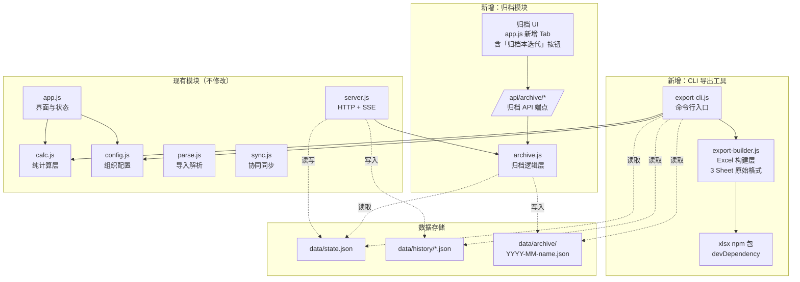
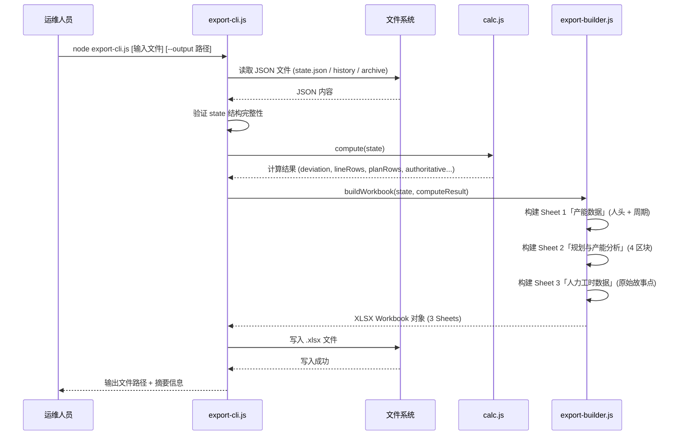
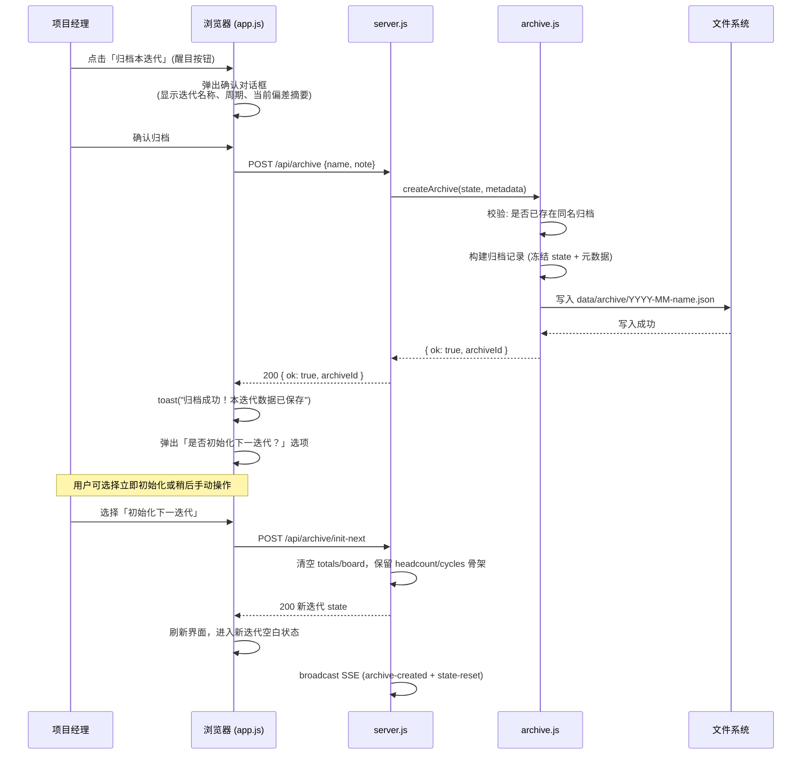
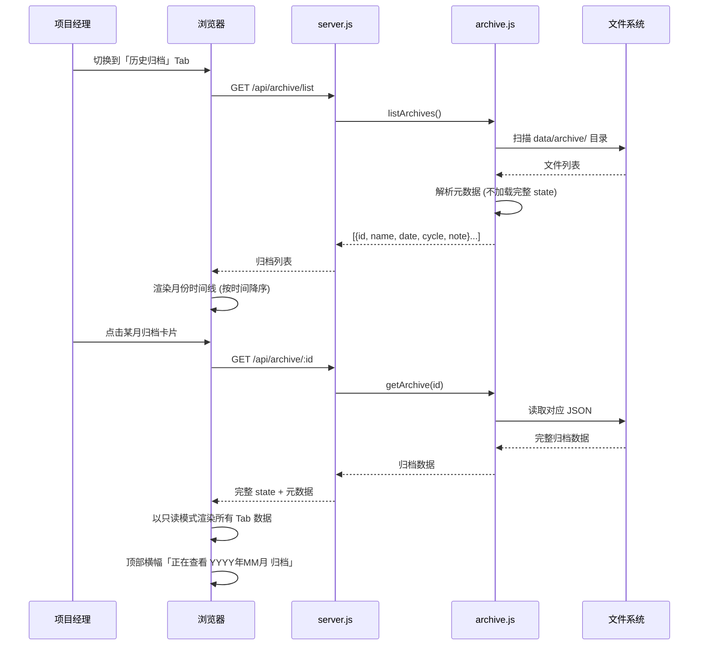

# Design Document: Data Resilience and Archiving

## Overview

本设计覆盖人力产能工作台的两项数据韧性增强：

1. **JSON-to-Excel 兜底导出工具** — 一个独立的 CLI 脚本，在工作台服务不可用时仍能将 `data/state.json`（或 `data/history/*.json`、`data/archive/*.json`）还原为与原始 Excel 文件（`云平台-2026年7月人力情况.xlsx`）格式完全一致的 `.xlsx` 文件。输出文件包含原始 Excel 的 3 张工作表（`7月产能数据`、`规划与产能分析`、`人力工时数据`），保持原始排版和分区布局。该工具无需启动 HTTP 服务，也无需浏览器环境，运维人员直接在服务器终端执行即可获得与原始文件一致的可读 Excel 报表。

2. **迭代归档与历史数据管理** — 在现有的 revision-level 快照机制之上，增加迭代粒度的"归档"语义。每月产能评审会（人力会）完成后，用户明确执行"归档本迭代"操作，将当前状态锁定为该迭代的最终记录，存入独立的 `data/archive/` 目录。归档是两个迭代之间的"检查点"——保存旧迭代数据，并为启动下一迭代做好准备。归档后的数据不可被常规提交覆盖，支持按月浏览和年终回顾。

两项功能共享「数据恢复」的核心目标：无论服务崩溃、数据损坏、还是业务周期推进，用户始终能以可读形式访问完整的历史产能数据。


## Architecture

整体架构在现有 server + client 之上扩展，新增 CLI 模块和 Archive 模块，不改变核心运行时依赖关系。





## Sequence Diagrams

### Feature 1: CLI Fallback Export (原始 Excel 3-Sheet 格式)




### Feature 2: Iteration Archiving (迭代检查点)

用户工作流程：人力会 → 确认偏差解决 → 归档本迭代 → 次日开始新迭代填报




### Feature 2b: Browse Historical Archives (时间线浏览)




## Components and Interfaces

### Component 1: export-cli.js (CLI 导出入口)

**Purpose**: 命令行工具入口，解析参数、协调流程、输出结果。独立于 HTTP 服务运行。输出文件格式与原始 Excel（`云平台-2026年7月人力情况.xlsx`）的 3 Sheet 布局完全一致。

**Interface**:
```javascript
// 命令行用法:
// node export-cli.js                          → 默认读 data/state.json，输出到当前目录
// node export-cli.js data/history/8.13-rev48.json
// node export-cli.js data/archive/2026-07-8.13.json --output /tmp/report.xlsx
// node export-cli.js --all-archives           → 批量导出所有归档为 xlsx

/**
 * @param {string} inputPath  - JSON 文件路径 (默认 data/state.json)
 * @param {object} options    - { output: string, quiet: boolean }
 * @returns {string}          - 生成的 xlsx 文件路径
 */
function main(inputPath, options) { /* ... */ }
```

**Responsibilities**:
- 解析命令行参数 (process.argv)
- 验证输入文件存在且为合法 JSON
- 调用 calc.js 的 compute() 计算偏差等汇总数据
- 调用 export-builder.js 构建 Excel 工作簿（3 Sheet 原始格式）
- 输出文件并打印摘要到 stdout
- 异常时输出中文错误提示到 stderr 并以非零 exit code 退出


### Component 2: export-builder.js (Excel 构建层 — 原始 3-Sheet 格式)

**Purpose**: 纯函数模块，接收 state 和计算结果，返回与原始 Excel 文件格式完全一致的 3-Sheet XLSX Workbook。注意：这里**不是**按照平台 Web UI 的 Tab 布局生成表格，而是按照原始 Excel 模板（`云平台-2026年7月人力情况.xlsx`）的排版。

**原始 Excel 格式说明 (3 张工作表)**:

| Sheet 名称 | 内容 | 布局说明 |
|------------|------|----------|
| `{月份}产能数据` | 团队人头数 + 版本周期 + 专项锁定项目 | 上半部: 部门×方向的正式/外包/总人数矩阵；下半部: 版本周期方案表(封版/上线/天数)；右侧: 专项锁定项目列表 |
| `规划与产能分析` | 产品线汇总 + 版本规划汇总 + 团队产能明细 + 偏差分析 | 4 个区块纵向排列在同一张 Sheet 中 |
| `人力工时数据` | 原始迭代故事点数据 | 按「所属项目(层级1)」×「所在团队」×「迭代」展示原始工时 |

**Interface**:
```javascript
const XLSX = require('xlsx');

/**
 * 构建与原始 Excel 格式一致的 3-Sheet 工作簿
 * @param {object} state         - 完整 state 对象
 * @param {object} computeResult - calc.compute(state) 的返回值
 * @returns {object}             - XLSX Workbook 对象 (3 Sheets)
 */
function buildWorkbook(state, computeResult) { /* ... */ }

/**
 * Sheet 1: 产能数据 (人头数 + 周期 + 专项项目列表)
 * 格式: 与原始 Excel「7月产能数据」一致
 */
function buildCapacitySheet(state, computeResult) { /* ... */ }

/**
 * Sheet 2: 规划与产能分析 (4 区块合一)
 * 区块1: 产品线版本工作量汇总 (Row 0-6)
 * 区块2: 版本规划工作量汇总 (Row 8-15)
 * 区块3: 云团队产能明细 (Row 18-23)
 * 区块4: 团队版本工作量与团队产能偏差分析 (Row 25-45)
 */
function buildPlanningSheet(state, computeResult) { /* ... */ }

/**
 * Sheet 3: 人力工时数据 (原始迭代导出数据)
 * 按项目×团队×迭代展示故事点原始值
 */
function buildStoryPointSheet(state) { /* ... */ }

module.exports = { buildWorkbook, buildCapacitySheet, buildPlanningSheet, buildStoryPointSheet };
```

**Responsibilities**:
- 构建 3 张工作表，格式与原始 Excel 完全一致
- Sheet 1 `{月份}产能数据`: 部门矩阵（按原始布局：行=正式/外包/总人数，列=各团队方向）+ 版本周期方案表 + 专项锁定项目列表
- Sheet 2 `规划与产能分析`: 4 个区块纵向堆叠——产品线版本工作量汇总、版本规划工作量汇总、云团队产能明细（含产能计算）、偏差分析（含结论和备注）
- Sheet 3 `人力工时数据`: 原始故事点数据（按项目层级1分组，每行 = 团队 × 迭代的故事点/预估故事点）
- 设置列宽、数字格式，保持原始 Excel 的视觉风格
- 无副作用（不修改 state 或 computeResult）


### Component 3: archive.js (归档逻辑层)

**Purpose**: 服务端归档核心逻辑，管理归档的创建、查询、校验。归档是迭代之间的"检查点"——在人力会确认偏差解决后执行归档，冻结当前迭代数据，为次日开始新迭代做准备。

**Interface**:
```javascript
/**
 * 创建一条迭代归档（检查点）
 * @param {object} state    - 当前 state.json 的完整内容
 * @param {object} meta     - { name: string, note: string, archivedBy: string }
 * @returns {{ ok: boolean, id: string, path: string } | { error: string }}
 */
function createArchive(state, meta) { /* ... */ }

/**
 * 初始化下一迭代：清空工时数据，保留团队骨架
 * 归档成功后可选调用，为次日新迭代填报做准备
 * @param {object} currentState - 当前 state
 * @returns {object} - 新的空白 state（保留 cycles/headcount 骨架，清空 totals/board/iterations）
 */
function initNextIteration(currentState) { /* ... */ }

/**
 * 列出所有归档（仅元数据，不加载完整 state）
 * @returns {Array<{ id, name, date, cycle, note, archivedBy, archivedAt }>}
 */
function listArchives() { /* ... */ }

/**
 * 读取单条归档的完整数据
 * @param {string} id - 归档 ID (文件名去 .json)
 * @returns {{ meta: object, state: object } | null}
 */
function getArchive(id) { /* ... */ }

/**
 * 删除归档（仅管理员操作，需二次确认）
 * @param {string} id
 * @returns {{ ok: boolean } | { error: string }}
 */
function deleteArchive(id) { /* ... */ }

module.exports = { createArchive, initNextIteration, listArchives, getArchive, deleteArchive };
```

**Responsibilities**:
- 文件命名规则: `YYYY-MM-{online-date}.json`
- 防重复归档检查（同月同上线日期不可重复）
- 归档文件原子写入（tmp + rename 模式，与 writeState 一致）
- 目录自动创建
- `initNextIteration`: 归档后可选执行，清空 totals/board/iterations，保留 cycles 和 headcount 骨架
- 列表查询时只解析文件头部元数据，避免全量加载大文件


### Component 4: Server API 扩展 (server.js 新增路由)

**Purpose**: 在现有 HTTP 服务器中注册归档相关的 API 端点。

**Interface**:
```javascript
// 新增 API 端点:
// GET  /api/archive/list       → 归档列表
// GET  /api/archive/:id        → 单条归档详情
// POST /api/archive            → 创建归档（归档本迭代）
// POST /api/archive/init-next  → 初始化下一迭代（归档后可选操作）
// DELETE /api/archive/:id      → 删除归档 (需 ACCESS_TOKEN)
```

**Responsibilities**:
- 路由分发
- 请求体解析
- 访问控制（与现有 ACCESS_TOKEN 机制一致）
- SSE 广播归档事件
- init-next 路由：调用 archive.initNextIteration()，将结果写入 state.json，广播 state 变更


### Component 5: Archive UI (app.js 归档交互)

**Purpose**: 浏览器端归档操作界面，强调归档作为迭代检查点的核心地位。

**Responsibilities**:

**A) 「归档本迭代」按钮（醒目入口）**:
- 在偏差分析 Tab 或顶部操作区放置醒目的「归档本迭代」按钮
- 按钮样式为 primary/强调色，明确传达"这是本迭代收尾动作"
- 点击后弹出确认对话框，展示：
  - 当前迭代名称和版本周期（如"8.13 版本，28天开发周期"）
  - 关键数据摘要（总工作量、总产能、整体偏差比例）
  - 一句话说明：「归档后本迭代数据将被永久保存，后续修改不影响已归档内容」
- 确认后执行归档 → 成功提示

**B) 归档后「初始化下一迭代」选项**:
- 归档成功后，弹出提示：「本迭代已归档！是否初始化下一迭代？」
- 选择「是」: 清空工时数据(totals/board)，保留人头数和周期骨架，界面变为空白待填报状态
- 选择「稍后」: 保持当前数据不变，用户次日手动操作
- 此设计对应用户实际流程：人力会当天归档 → 次日开始新迭代数据填报

**C) 「历史归档」Tab（第 7 个 Tab）**:
- 月份时间线视图：按时间降序展示所有归档，每个归档显示为卡片
- 卡片内容：归档名称、日期、版本周期、偏差摘要、操作人
- 点击卡片进入只读模式，可浏览该月完整数据（所有 Tab 的数据都能查看）
- 只读模式下所有编辑控件禁用
- 顶部显示横幅「正在查看 YYYY年MM月 归档数据」+ 「返回当前迭代」按钮
- 支持在只读模式下导出该月数据为 Excel（同样使用原始格式）


## Data Models

### Model 1: Archive Record (归档记录文件格式)

```javascript
// 文件路径: data/archive/YYYY-MM-{online-date}.json
// 例: data/archive/2026-07-8.13.json
{
  "meta": {
    "id": "2026-07-8.13",           // 唯一标识 = 文件名去后缀
    "name": "2026年7月迭代",         // 用户可编辑的归档名称
    "archivedAt": "2026/8/1 14:30:00", // 归档时间
    "archivedBy": "张三",            // 执行归档的人
    "note": "7月产能评审已通过，偏差已解决",  // 可选备注
    "cycle": {                       // 冗余存储当期周期信息，便于列表展示
      "seal": "8.10",
      "online": "8.13",
      "workdays": 25,
      "saturdays": 3
    },
    "iterations": ["阳光云-20260710迭代", "阳光云-20260801迭代"],
    "summary": {                     // 归档时的关键指标摘要
      "totalWorkload": 2521.6,
      "totalCapacity": 2100,
      "overallDeviation": 0.20,
      "teamCount": 18
    },
    "rev": 48,                       // 归档时的版本号
    "stateUpdatedAt": "2026/7/31 18:45:00" // 原始 state 的最后更新时间
  },
  "state": {
    // 完整的 state 对象快照 (与 state.json 结构完全一致)
    "cycles": [...],
    "headcount": {...},
    "locked": [...],
    "totals": [...],
    "board": [...],
    "iterations": [...],
    "sources": {...},
    "rev": 48,
    "updatedAt": "...",
    "updatedBy": "..."
  }
}
```

**Validation Rules**:
- `meta.id` 必须唯一，由年月+上线日期自动生成
- `meta.archivedAt` 为服务端生成的时间戳，不可客户端伪造
- `meta.archivedBy` 取自 Sync.whoami() 返回的用户名
- `meta.summary` 由服务端从 compute(state) 自动计算，用于列表展示时免加载完整 state
- `state` 字段必须为完整合法的 state 对象（含 cycles、headcount 等全部顶层字段）
- 文件名仅含 ASCII 字符和中划线，不含空格或特殊字符


### Model 2: CLI Export Options (CLI 参数模型)

```javascript
{
  "input": "data/state.json",        // 输入文件路径
  "output": "./云平台人力产能-8.13.xlsx", // 输出文件路径 (自动推导)
  "quiet": false,                    // 是否静默模式（不输出摘要）
  "allArchives": false               // 批量导出所有归档
}
```

**Validation Rules**:
- `input` 文件必须存在且为合法 JSON
- `output` 目录必须可写
- 输出文件名自动推导规则: `云平台人力产能-{online-date}.xlsx`
- 若输出文件已存在，CLI 默认覆盖（不交互式询问，便于脚本调用）

### Model 3: Archive List Response (归档列表 API 响应)

```javascript
// GET /api/archive/list 响应格式
[
  {
    "id": "2026-07-8.13",
    "name": "2026年7月迭代",
    "archivedAt": "2026/8/1 14:30:00",
    "archivedBy": "张三",
    "note": "7月产能评审已通过，偏差已解决",
    "cycle": { "seal": "8.10", "online": "8.13", "workdays": 25, "saturdays": 3 },
    "iterations": ["阳光云-20260710迭代", "阳光云-20260801迭代"],
    "summary": { "totalWorkload": 2521.6, "totalCapacity": 2100, "overallDeviation": 0.20, "teamCount": 18 },
    "rev": 48
  }
  // ... 按 archivedAt 降序
]
```

### Model 4: Init Next Iteration Response

```javascript
// POST /api/archive/init-next 响应格式
{
  "ok": true,
  "cleared": ["totals", "board", "iterations"],  // 被清空的字段
  "preserved": ["cycles", "headcount", "locked"], // 保留的字段
  "newRev": 49                                    // 新的版本号
}
```


## Algorithmic Pseudocode

### Algorithm 1: CLI Export Main Flow

```javascript
// export-cli.js 主流程
function main() {
  // STEP 1: 解析命令行参数
  const args = parseArgs(process.argv.slice(2));
  // args = { input, output, quiet, allArchives }

  // STEP 2: 批量模式
  if (args.allArchives) {
    const archiveDir = path.join(DATA_DIR, 'archive');
    const files = fs.readdirSync(archiveDir).filter(f => f.endsWith('.json'));
    // LOOP INVARIANT: 已处理的文件均成功生成了对应 xlsx
    for (const file of files) {
      const outPath = exportSingle(path.join(archiveDir, file), args);
      if (!args.quiet) console.log(`✓ ${file} → ${outPath}`);
    }
    return;
  }

  // STEP 3: 单文件模式
  exportSingle(args.input, args);
}

function exportSingle(inputPath, args) {
  // PRECONDITION: inputPath 存在且为合法 JSON 文件
  const raw = fs.readFileSync(inputPath, 'utf8');
  const data = JSON.parse(raw);

  // 归档文件结构: { meta, state } vs 普通 state 文件
  const state = data.state || data;

  // STEP: 验证 state 完整性
  validateState(state);

  // STEP: 执行计算
  const result = compute(state);

  // STEP: 构建工作簿 (3 Sheet 原始格式)
  const wb = buildWorkbook(state, result);

  // STEP: 推导输出路径
  const outputPath = args.output || deriveOutputPath(state, inputPath);

  // STEP: 写入文件
  XLSX.writeFile(wb, outputPath);

  // POSTCONDITION: outputPath 文件存在且为合法 xlsx，含 3 张工作表
  if (!args.quiet) {
    printSummary(state, result, outputPath);
  }
  return outputPath;
}
```


### Algorithm 2: Build Workbook (原始 3-Sheet 格式)

```javascript
// export-builder.js - buildWorkbook
// 生成与原始 Excel「云平台-2026年7月人力情况.xlsx」完全一致的 3 Sheet 布局
function buildWorkbook(state, computeResult) {
  const wb = XLSX.utils.book_new();
  const cycle = state.cycles.find(c => c.active) || state.cycles[0];
  const monthLabel = deriveMonthLabel(cycle); // 如 "7月"

  // Sheet 1: {月份}产能数据
  // 布局: 上部=团队人头矩阵(部门方向为列, 正式/外包/总为行)
  //        下部=版本周期方案表
  //        右侧=专项锁定项目列表
  XLSX.utils.book_append_sheet(wb, buildCapacitySheet(state, computeResult), `${monthLabel}产能数据`);

  // Sheet 2: 规划与产能分析
  // 布局: 4 个区块纵向排列在同一 Sheet
  //   区块1 (Row 0-6):  产品线版本工作量汇总
  //   区块2 (Row 8-15): 版本规划工作量汇总
  //   区块3 (Row 18-23): 云团队产能明细 (人数 + 产能天数)
  //   区块4 (Row 25-45): 团队版本工作量与团队产能偏差分析
  XLSX.utils.book_append_sheet(wb, buildPlanningSheet(state, computeResult), '规划与产能分析');

  // Sheet 3: 人力工时数据
  // 布局: 按「所属项目(层级1)」分组, 列=迭代×(故事点/预估故事点)
  XLSX.utils.book_append_sheet(wb, buildStoryPointSheet(state), '人力工时数据');

  return wb;
}
```


### Algorithm 3: Build Capacity Sheet (Sheet 1 详细布局)

```javascript
// Sheet 1: 产能数据 - 对标原始 Excel「7月产能数据」
function buildCapacitySheet(state, computeResult) {
  const aoa = [];
  const teams = TEAMS; // 所有团队

  // Row 0: 部门分组标题行 (合并单元格)
  // ["", "APP开发", "", "后端开发", "", "Web开发", "", "中台开发", ...]
  const deptRow = [''];
  // Row 1: 方向明细标题行
  // ["", "阳光云", "平台", "阳光云", "平台", ...]
  const dirRow = [''];

  // 按部门分组写入列头 (与原始 Excel 一致)
  const depts = groupByDept(teams);
  depts.forEach(dept => {
    deptRow.push(dept.name);
    for (let i = 1; i < dept.teams.length; i++) deptRow.push('');
    dept.teams.forEach(t => dirRow.push(t.shortName));
  });
  deptRow.push('云平台总人数');
  dirRow.push('');
  aoa.push(deptRow, dirRow);

  // Row 2: 正式人数
  const regularRow = ['正式人数'];
  teams.forEach(t => regularRow.push((state.headcount[t.key] || {}).regular || ''));
  regularRow.push(computeResult.totals.head); // 仅正式
  aoa.push(regularRow);

  // Row 3: 外包人数
  const outsourceRow = ['外包人数'];
  teams.forEach(t => outsourceRow.push((state.headcount[t.key] || {}).outsource || ''));
  outsourceRow.push(''); // 外包合计
  aoa.push(outsourceRow);

  // Row 4: 总人数
  const totalRow = ['总人数'];
  teams.forEach(t => totalRow.push(computeResult.heads[t.key] || 0));
  totalRow.push(Object.values(computeResult.heads).reduce((s, v) => s + v, 0));
  aoa.push(totalRow);

  // 空行分隔
  aoa.push([]);

  // 右侧区域: 专项锁定项目列表 (在原始 Excel 中位于列 V+ 的区域)
  // 实际实现中通过偏移写入同一 sheet 的右侧区域

  // 下半部: 版本周期方案表
  // Row 12+: 版本上线时间表头
  aoa.push([]); aoa.push([]); aoa.push([]); aoa.push([]); aoa.push([]); aoa.push([]);
  aoa.push(['版本上线时间']);
  aoa.push(['封版时间', '上线时间', '工作日', '周六天数', '开发周期', '是否采用']);
  state.cycles.forEach(c => {
    aoa.push([c.seal, c.online, c.workdays, c.saturdays,
      (c.workdays || 0) + (c.saturdays || 0), c.active ? true : '']);
  });

  // 结论行
  const activeCycle = state.cycles.find(c => c.active) || state.cycles[0];
  if (activeCycle && activeCycle.note) {
    aoa.push([activeCycle.note]);
  }

  return XLSX.utils.aoa_to_sheet(aoa);
}
```


### Algorithm 4: Build Planning Sheet (Sheet 2 四区块布局)

```javascript
// Sheet 2: 规划与产能分析 - 4 个区块纵向排列
function buildPlanningSheet(state, computeResult) {
  const aoa = [];
  const teams = TEAMS;
  const teamHeaders = teams.map(t => t.key);

  // ═══ 区块 1: 产品线版本工作量汇总 ═══
  aoa.push(['产品线版本工作量汇总']);
  aoa.push(['产线'].concat(teamHeaders).concat(['版本工作量（人天）']));
  computeResult.lineRows.forEach(r => {
    aoa.push([r.key].concat(teams.map(t => r.values[t.key] || 0)).concat([rowTotal(r.values)]));
  });
  aoa.push(['产品线汇总'].concat(teams.map(t => computeResult.lineSummary[t.key] || 0))
    .concat([rowTotal(computeResult.lineSummary)]));
  aoa.push([]); aoa.push([]); // 空行分隔

  // ═══ 区块 2: 版本规划工作量汇总 ═══
  aoa.push(['版本规划工作量汇总']);
  aoa.push(['分类'].concat(teamHeaders).concat(['需求总人力（人天）']));
  computeResult.planRows.forEach(r => {
    aoa.push([r.key].concat(teams.map(t => r.values[t.key] || 0)).concat([rowTotal(r.values)]));
  });
  aoa.push(['合计'].concat(teams.map(t => computeResult.planTotal[t.key] || 0))
    .concat([rowTotal(computeResult.planTotal)]));
  aoa.push([]); aoa.push([]); // 空行分隔

  // ═══ 区块 3: 云团队产能明细 ═══
  aoa.push(['云团队产能明细']);
  aoa.push(['人数']);
  const capacityHeaders = teamHeaders.concat(['总人数', '研发天数'])
    .concat(teams.map(t => '产能-' + t.key));
  aoa.push(['员工类型'].concat(capacityHeaders));
  // 正式、外包、汇总行 (含产能计算列)
  const days = computeResult.days;
  ['正式', '外包', '汇总'].forEach(type => {
    const row = [type];
    teams.forEach(t => {
      const h = state.headcount[t.key] || {};
      row.push(type === '正式' ? (h.regular || 0) :
               type === '外包' ? (h.outsource || 0) :
               computeResult.heads[t.key] || 0);
    });
    const totalHead = teams.reduce((s, t) => s + (type === '汇总' ? computeResult.heads[t.key] || 0 : 0), 0);
    row.push(totalHead, days);
    // 产能列 = 人数 × 天数
    teams.forEach(t => {
      const head = type === '汇总' ? computeResult.heads[t.key] || 0 : 0;
      row.push(head * days);
    });
    aoa.push(row);
  });
  aoa.push([]); aoa.push([]); // 空行分隔

  // ═══ 区块 4: 团队版本工作量与团队产能偏差分析 ═══
  aoa.push(['团队版本工作量与团队产能偏差分析']);
  aoa.push(['团队', '版本工作量（人天）', '总产能\n（人天）', '超出工作量', '超出比例',
    '处理方式', '总产能\n（28人天）', '超出工作量', '超出比例', '', '', '',
    '封版时间', '上线时间', '工作日', '周六天数', '开发周期', '是否采用']);
  computeResult.deviation.forEach(d => {
    aoa.push([d.team, d.workload, d.capacity, d.over,
      d.ratio, '', '', '', '', '', '', '', '', '', '', '', '', '']);
  });
  // 脚注
  aoa.push([]);
  aoa.push(['1、超出工作量=团队版本工作量-团队产能\n2、超出工作量为负数说明产能富余；为正数说明产能不足\n3、超出比例±10%以内属于正常偏差']);

  return XLSX.utils.aoa_to_sheet(aoa);
}
```


### Algorithm 5: Build Story Point Sheet (Sheet 3 原始工时)

```javascript
// Sheet 3: 人力工时数据 - 原始迭代故事点
function buildStoryPointSheet(state) {
  const aoa = [];
  const selectedIters = (state.iterations || []).filter(i => i.selected).map(i => i.name);

  // 标题行: 所属项目(层级1) | 所在团队 | 迭代1(故事点/预估) | 迭代2(故事点/预估) | ...
  const headerRow1 = ['所属项目(层级1)', '所在团队'];
  const headerRow2 = ['', ''];
  selectedIters.forEach(iter => {
    headerRow1.push(iter, '');
    headerRow2.push('故事点 (求和)', '预估故事点 (求和)');
  });
  headerRow1.push('', '项目_公式辅助列');
  headerRow2.push('', '');
  aoa.push(headerRow1, headerRow2);

  // 按「所属项目(层级1)」分组，每组按团队列出故事点
  const grouped = groupByProject(state.totals, state.board, selectedIters);
  grouped.forEach(group => {
    group.rows.forEach((row, idx) => {
      const dataRow = [idx === 0 ? group.project : '', row.team];
      selectedIters.forEach(iter => {
        dataRow.push(row.storyByIter[iter] || 0, row.estByIter[iter] || 0);
      });
      dataRow.push('', idx === 0 ? group.project : '');
      aoa.push(dataRow);
    });
  });

  return XLSX.utils.aoa_to_sheet(aoa);
}
```


### Algorithm 6: Archive Creation (迭代检查点)

```javascript
// archive.js - createArchive
function createArchive(currentState, meta) {
  // PRECONDITION: currentState 为合法 state 对象
  // PRECONDITION: meta.name 非空字符串
  // PRECONDITION: data/archive/ 目录可写

  const cycle = currentState.cycles.find(c => c.active) || currentState.cycles[0];
  const now = new Date();
  const yearMonth = `${now.getFullYear()}-${String(now.getMonth() + 1).padStart(2, '0')}`;
  const onlineTag = String(cycle.online || 'unnamed').replace(/[^\w.-]/g, '_');
  const id = `${yearMonth}-${onlineTag}`;
  const filePath = path.join(ARCHIVE_DIR, `${id}.json`);

  // 防重复检查
  if (fs.existsSync(filePath)) {
    return { error: `本月已存在归档「${id}」，如需覆盖请先删除原归档` };
  }

  // 计算关键指标摘要（用于列表展示）
  const result = compute(currentState);
  const summary = {
    totalWorkload: result.totals.workload,
    totalCapacity: result.totals.capacity,
    overallDeviation: result.totals.capacity ?
      (result.totals.workload - result.totals.capacity) / result.totals.capacity : 0,
    teamCount: TEAMS.length
  };

  // 构建归档记录
  const record = {
    meta: {
      id,
      name: meta.name || `${yearMonth} 迭代`,
      archivedAt: now.toLocaleString('zh-CN'),
      archivedBy: meta.archivedBy || '未署名',
      note: meta.note || '',
      cycle: { seal: cycle.seal, online: cycle.online, workdays: cycle.workdays, saturdays: cycle.saturdays },
      iterations: (currentState.iterations || []).filter(i => i.selected).map(i => i.name),
      summary: summary,
      rev: currentState.rev,
      stateUpdatedAt: currentState.updatedAt
    },
    state: JSON.parse(JSON.stringify(currentState)) // 深拷贝，冻结快照
  };

  // 原子写入
  ensureDir(ARCHIVE_DIR);
  const tmp = filePath + '.tmp';
  fs.writeFileSync(tmp, JSON.stringify(record, null, 2), 'utf8');
  fs.renameSync(tmp, filePath);

  // POSTCONDITION: filePath 存在且为合法归档 JSON
  return { ok: true, id, path: filePath };
}
```


### Algorithm 7: Initialize Next Iteration

```javascript
// archive.js - initNextIteration
// 归档后可选操作：清空工时数据，保留团队骨架，为新迭代做准备
function initNextIteration(currentState) {
  // PRECONDITION: 归档已成功完成（当前 state 已被冻结到 archive 文件中）
  // PRECONDITION: currentState 为合法 state 对象

  const newState = {
    // 保留: 周期方案骨架（用户次日可能调整封版/上线日期）
    cycles: currentState.cycles.map(c => ({
      ...c,
      active: false,  // 所有方案重置为非激活，等待用户设定新周期
      note: ''
    })),
    // 保留: 团队人头数（通常各月变化不大，用户可在新迭代中微调）
    headcount: JSON.parse(JSON.stringify(currentState.headcount)),
    // 保留: 专项锁定项目（跨迭代的长期项目）
    locked: JSON.parse(JSON.stringify(currentState.locked)),
    // 清空: 工时数据（新迭代需要重新导入）
    totals: [],
    board: [],
    // 清空: 迭代选择（新迭代有新的迭代名称）
    iterations: [],
    // 清空: 数据源记录
    sources: {},
    // 递增版本号
    rev: (currentState.rev || 0) + 1,
    updatedAt: new Date().toLocaleString('zh-CN'),
    updatedBy: '系统(初始化新迭代)'
  };

  // POSTCONDITION: newState 包含有效的 headcount 和 cycles，但 totals/board 为空
  return newState;
}
```


### Algorithm 8: Archive List (高效扫描)

```javascript
// archive.js - listArchives
function listArchives() {
  // PRECONDITION: ARCHIVE_DIR 可读 (不存在时返回空数组)
  if (!fs.existsSync(ARCHIVE_DIR)) return [];

  const files = fs.readdirSync(ARCHIVE_DIR).filter(f => f.endsWith('.json'));
  const archives = [];

  for (const file of files) {
    try {
      const full = JSON.parse(fs.readFileSync(path.join(ARCHIVE_DIR, file), 'utf8'));
      if (full.meta) archives.push(full.meta);
    } catch (e) {
      // 文件损坏则跳过，不影响其他归档的展示
    }
  }

  // POSTCONDITION: 返回按时间降序的 meta 数组
  return archives.sort((a, b) =>
    new Date(b.archivedAt).getTime() - new Date(a.archivedAt).getTime()
  );
}
```


## Key Functions with Formal Specifications

### Function 1: buildWorkbook(state, computeResult)

```javascript
function buildWorkbook(state, computeResult) {
  const wb = XLSX.utils.book_new();
  const cycle = state.cycles.find(c => c.active) || state.cycles[0];
  const monthLabel = deriveMonthLabel(cycle);
  XLSX.utils.book_append_sheet(wb, buildCapacitySheet(state, computeResult), `${monthLabel}产能数据`);
  XLSX.utils.book_append_sheet(wb, buildPlanningSheet(state, computeResult), '规划与产能分析');
  XLSX.utils.book_append_sheet(wb, buildStoryPointSheet(state), '人力工时数据');
  return wb;
}
```

**Preconditions:**
- `state` 非 null，包含 cycles、headcount、locked、totals、board、iterations 等顶层字段
- `computeResult` 为 `calc.compute(state)` 的返回值
- XLSX 库已正确加载

**Postconditions:**
- 返回的 Workbook 对象包含恰好 3 张 Sheet
- Sheet 名称分别为 `{月份}产能数据`、`规划与产能分析`、`人力工时数据`
- 布局与原始文件 `云平台-2026年7月人力情况.xlsx` 一致
- 无副作用（不修改 state 或 computeResult）

**Loop Invariants:** N/A (顺序构建，无循环)

### Function 2: validateState(state)

```javascript
function validateState(state) {
  const required = ['cycles', 'headcount', 'locked', 'totals', 'iterations'];
  const missing = required.filter(k => !(k in state));
  if (missing.length > 0) {
    throw new Error(`state 缺少必需字段: ${missing.join(', ')}`);
  }
  if (!Array.isArray(state.cycles) || state.cycles.length === 0) {
    throw new Error('cycles 必须为非空数组');
  }
  return true;
}
```

**Preconditions:**
- `state` 为 JSON.parse() 的结果（非 null 的对象）

**Postconditions:**
- 若返回 true，则 state 包含所有必需字段且 cycles 至少有一条记录
- 若 state 不合法，抛出带描述性中文消息的 Error

**Loop Invariants:** N/A


### Function 3: createArchive(state, meta)

**Preconditions:**
- `state` 为当前 state.json 的合法内容（由 readState() 返回）
- `state.cycles` 中至少有一条 active 记录
- `meta.archivedBy` 为非空字符串
- ARCHIVE_DIR 的父目录可写

**Postconditions:**
- 成功时: `data/archive/{id}.json` 存在，内容为 `{ meta, state }` 结构，meta.id 与文件名一致
- 失败时: 文件系统无变更，返回 `{ error: string }`
- 不修改 `data/state.json`
- 不修改 `data/history/` 内容

**Loop Invariants:** N/A

### Function 4: initNextIteration(currentState)

```javascript
function initNextIteration(currentState) { /* 见 Algorithm 7 */ }
```

**Preconditions:**
- `currentState` 为合法 state 对象
- 归档操作已成功完成（当前 state 已冻结到 archive 文件）

**Postconditions:**
- 返回新的 state 对象，`totals` 和 `board` 为空数组
- `headcount` 和 `locked` 保留原值（深拷贝）
- `cycles` 保留结构但 active 全部重置为 false
- `rev` 递增 1
- 不修改输入的 `currentState` 对象

**Loop Invariants:** N/A

### Function 5: deriveOutputPath(state, inputPath)

```javascript
function deriveOutputPath(state, inputPath) {
  const cycle = state.cycles.find(c => c.active) || state.cycles[0];
  const tag = cycle.online || path.basename(inputPath, '.json');
  return path.join(path.dirname(inputPath), `云平台人力产能-${tag}.xlsx`);
}
```

**Preconditions:**
- `state.cycles` 为非空数组
- `inputPath` 为有效的文件路径字符串

**Postconditions:**
- 返回的路径以 `.xlsx` 结尾
- 输出目录与输入文件同目录
- 文件名包含上线日期标识

**Loop Invariants:** N/A


## Example Usage

### CLI Export Tool

```javascript
// 最常见场景：服务崩溃后恢复数据
// 运维人员 SSH 到服务器，在项目目录执行：

// 1. 导出当前状态（生成与原始 Excel 格式一致的 3-Sheet 文件）
$ node export-cli.js
// ✓ 已生成: ./云平台人力产能-8.13.xlsx
// 摘要: 方案一 | 封版 8.10 上线 8.13 | 28天 | 48 rev
//       包含: 7月产能数据 | 规划与产能分析 | 人力工时数据

// 2. 导出特定历史快照
$ node export-cli.js data/history/8.13-rev30.json
// ✓ 已生成: data/history/云平台人力产能-8.13.xlsx

// 3. 导出特定归档
$ node export-cli.js data/archive/2026-07-8.13.json --output /tmp/7月报表.xlsx
// ✓ 已生成: /tmp/7月报表.xlsx
// 格式: 3 Sheets (7月产能数据, 规划与产能分析, 人力工时数据)

// 4. 批量导出所有归档 (年终审计)
$ node export-cli.js --all-archives
// ✓ 2026-04-4.15.json → data/archive/云平台人力产能-4.15.xlsx
// ✓ 2026-05-5.12.json → data/archive/云平台人力产能-5.12.xlsx
// ✓ 2026-06-6.16.json → data/archive/云平台人力产能-6.16.xlsx
// ✓ 2026-07-8.13.json → data/archive/云平台人力产能-8.13.xlsx
```


### Archive Workflow (完整用户流程)

```javascript
// 用户完整工作流程:
// Day 1 (人力会当天): 评审完成 → 归档 → 可选初始化下一迭代
// Day 2 (次日): 开始填报新迭代数据

// === Day 1: 归档本迭代 ===

// Step 1: 用户点击「归档本迭代」按钮
// 系统展示确认对话框:
//   "确认归档「8.13版本」迭代？"
//   "总工作量 2521.6 人天 | 总产能 2100 人天 | 整体偏差 +20%"
//   "归档后数据将永久保存，不受后续修改影响"

// Step 2: 确认归档
const response = await fetch('/api/archive', {
  method: 'POST',
  headers: { 'Content-Type': 'application/json' },
  body: JSON.stringify({
    name: '2026年7月迭代',
    note: '7月产能评审已通过，偏差已解决',
    archivedBy: '张三'
  })
});
// { ok: true, id: "2026-07-8.13" }

// Step 3: 系统提示「是否初始化下一迭代？」
// 用户选择「是」→ 清空工时，保留人头数骨架
const initResponse = await fetch('/api/archive/init-next', { method: 'POST' });
// { ok: true, cleared: ["totals", "board", "iterations"], preserved: ["cycles", "headcount", "locked"] }

// === Day 2: 新迭代开始 ===
// 界面已是空白状态，用户导入新的工时数据、设定新周期
```


### Archive Browsing (历史归档浏览)

```javascript
// 浏览历史归档

// 列出所有归档（时间线视图）
const list = await fetch('/api/archive/list').then(r => r.json());
// [
//   { id: "2026-07-8.13", name: "2026年7月迭代", archivedAt: "2026/8/1 14:30:00",
//     summary: { totalWorkload: 2521.6, totalCapacity: 2100, overallDeviation: 0.20 }, ... },
//   { id: "2026-06-6.16", name: "2026年6月迭代", archivedAt: "2026/7/1 10:00:00", ... },
//   ...
// ]

// 查看某月归档详情（只读模式）
const archive = await fetch('/api/archive/2026-07-8.13').then(r => r.json());
// { meta: {...}, state: {...} }
// UI 以只读模式渲染 state 中的各项数据
// 顶部横幅: 「正在查看 2026年7月 归档数据」[返回当前迭代]
```


### Server-side Route Registration

```javascript
// server.js 中注册路由示例
const archive = require('./archive');

// 在请求处理函数中:
if (p === '/api/archive/list' && req.method === 'GET') {
  return sendJson(res, 200, archive.listArchives());
}

if (p === '/api/archive' && req.method === 'POST') {
  const state = readState();
  const result = archive.createArchive(state, {
    name: body.name,
    note: body.note,
    archivedBy: body.archivedBy
  });
  if (result.error) return sendJson(res, 409, result);
  broadcast(state.rev, `${body.archivedBy}(归档)`);
  return sendJson(res, 200, result);
}

if (p === '/api/archive/init-next' && req.method === 'POST') {
  const state = readState();
  const newState = archive.initNextIteration(state);
  writeState(newState);
  broadcast(newState.rev, '系统(初始化新迭代)');
  return sendJson(res, 200, {
    ok: true,
    cleared: ['totals', 'board', 'iterations'],
    preserved: ['cycles', 'headcount', 'locked'],
    newRev: newState.rev
  });
}

if (/^\/api\/archive\/[\w.-]+$/.test(p) && req.method === 'GET') {
  const id = p.split('/').pop();
  const data = archive.getArchive(id);
  if (!data) return sendJson(res, 404, { error: '归档不存在' });
  return sendJson(res, 200, data);
}

if (/^\/api\/archive\/[\w.-]+$/.test(p) && req.method === 'DELETE') {
  const id = p.split('/').pop();
  const result = archive.deleteArchive(id);
  if (result.error) return sendJson(res, 400, result);
  return sendJson(res, 200, result);
}
```


## Correctness Properties

以下为系统必须保证的正确性属性（以断言形式表达）：

```javascript
// Property 1: CLI 导出格式一致性
// 输出文件的 Sheet 结构必须与原始 Excel 一致（3 张表）
const wb = buildWorkbook(state, compute(state));
assert(wb.SheetNames.length === 3);
assert(wb.SheetNames[1] === '规划与产能分析');
assert(wb.SheetNames[2] === '人力工时数据');

// Property 2: CLI 导出幂等性
// 对同一输入文件执行多次导出，生成的 xlsx 内容完全相同
assert(
  hash(exportCli('data/state.json')) === hash(exportCli('data/state.json'))
);

// Property 3: 归档不可变性
// 创建归档后，归档文件的 state 内容不受后续 state.json 变更影响
const archiveBefore = readArchive('2026-07-8.13');
modifyStateJson(); // 执行任意提交
const archiveAfter = readArchive('2026-07-8.13');
assert(JSON.stringify(archiveBefore.state) === JSON.stringify(archiveAfter.state));

// Property 4: 归档唯一性
// 同月同上线日期不可创建两条归档
const r1 = createArchive(state, { name: 'A', archivedBy: '张三' });
const r2 = createArchive(state, { name: 'B', archivedBy: '李四' });
assert(r1.ok === true && r2.error !== undefined);

// Property 5: 数据完整性
// 任何合法的 state.json 都能被 CLI 成功导出为 3-Sheet xlsx
for (const file of allJsonFiles('data/history')) {
  const state = JSON.parse(fs.readFileSync(file, 'utf8'));
  if (validateState(state)) {
    const wb = buildWorkbook(state, compute(state));
    assert(wb.SheetNames.length === 3);
  }
}

// Property 6: 归档可还原
// 任何归档的 state 都能被 CLI 成功导出为与原始格式一致的 xlsx
for (const archive of listArchives()) {
  const data = getArchive(archive.id);
  const result = compute(data.state);
  const wb = buildWorkbook(data.state, result);
  assert(wb.SheetNames.length === 3);
}

// Property 7: 初始化下一迭代的完整性
// initNextIteration 保留骨架、清空工时
const newState = initNextIteration(state);
assert(Object.keys(newState.headcount).length === Object.keys(state.headcount).length);
assert(newState.totals.length === 0);
assert(newState.board.length === 0);
assert(newState.iterations.length === 0);
assert(newState.rev === state.rev + 1);

// Property 8: Sheet 2 区块完整性
// 规划与产能分析 Sheet 必须包含 4 个区块的标题行
const planSheet = buildPlanningSheet(state, compute(state));
const sheetData = XLSX.utils.sheet_to_json(planSheet, {header: 1});
const titles = sheetData.filter(row => row[0] && typeof row[0] === 'string');
assert(titles.some(r => r[0].includes('产品线版本工作量汇总')));
assert(titles.some(r => r[0].includes('版本规划工作量汇总')));
assert(titles.some(r => r[0].includes('云团队产能明细')));
assert(titles.some(r => r[0].includes('偏差分析')));
```


## Error Handling

### Error Scenario 1: 输入文件不存在或不可读

**Condition**: CLI 指定的 JSON 文件路径不存在或无读权限
**Response**: 输出中文错误信息到 stderr: `错误: 文件不存在或不可读: {path}`
**Recovery**: 以 exit code 1 退出；建议用户检查文件路径

### Error Scenario 2: JSON 解析失败（文件损坏）

**Condition**: 文件存在但内容不是合法 JSON（如写盘中途断电导致截断）
**Response**: 输出: `错误: JSON 解析失败: {parseError.message}`
**Recovery**: 
- 提示用户尝试 `data/history/` 中最近的快照
- 若 `--fallback` 参数启用，自动尝试 history 中最高 rev 的可用文件

### Error Scenario 3: state 结构不完整

**Condition**: JSON 合法但缺少必要字段（如只有 cycles 没有 headcount）
**Response**: 输出: `警告: state 缺少字段 {fields}，对应区块将为空`
**Recovery**: 仍然生成 xlsx，缺失字段对应的区块包含标题行但无数据行。不中断流程。

### Error Scenario 4: 重复归档

**Condition**: 用户尝试归档已存在同 ID 的月份
**Response**: API 返回 409 + error 信息；UI 显示 toast 提示
**Recovery**: 用户需先删除旧归档或等待下月。UI 提供「查看现有归档」快捷入口。

### Error Scenario 5: 磁盘空间不足

**Condition**: 归档写入或 xlsx 生成时磁盘已满
**Response**: 
- 归档: 原子写入失败 (tmp 文件写入抛异常)，返回 500 + error
- CLI: 输出 `错误: 磁盘写入失败: {error.message}`
**Recovery**: 原子写入保证不会产生半成品文件；提示用户清理磁盘空间

### Error Scenario 6: 服务不可用时的归档

**Condition**: 用户点击归档但服务断连
**Response**: 「归档本迭代」按钮置灰 + tooltip「服务未连接，归档需在线执行」
**Recovery**: 归档操作必须在线完成（需服务端执行），无法离线暂存

### Error Scenario 7: 初始化下一迭代失败

**Condition**: 用户选择初始化下一迭代但服务端写入失败
**Response**: API 返回 500 + error；UI 提示「初始化失败，请重试」
**Recovery**: 归档文件已安全保存，不受影响。用户可手动清空数据或重试初始化。


## Testing Strategy

### Unit Testing Approach

使用 Node.js 内置 `node:test` + `node:assert`（保持零外部依赖测试哲学），或可选 `vitest`。

**CLI 导出模块测试** (`_test-export.js`):
- `validateState()` 对合法和非法输入的行为
- `deriveOutputPath()` 在各种 cycle 配置下的文件名推导
- `buildWorkbook()` 输出包含恰好 3 张 Sheet
- Sheet 1 (`产能数据`): 验证人头数矩阵行数正确、周期方案区块存在
- Sheet 2 (`规划与产能分析`): 验证 4 个区块标题行存在且位置正确
- Sheet 3 (`人力工时数据`): 验证按项目分组、列头含迭代名
- 数值精度（浮点数不丢失）
- 空 state（无 totals/board 数据）的降级处理

**归档模块测试** (`_test-archive.js`):
- `createArchive()` 正常创建 + 写入文件验证 + summary 字段正确
- `createArchive()` 重复 ID 拒绝
- `initNextIteration()` 保留 headcount、清空 totals/board
- `initNextIteration()` rev 递增
- `listArchives()` 空目录返回 []
- `listArchives()` 含损坏文件时的容错
- `getArchive()` 正常读取和不存在 ID 的 null 返回
- `deleteArchive()` 删除后 listArchives 不再包含该条目

### Property-Based Testing Approach

**Property Test Library**: `fast-check` (npm devDependency)

```javascript
const fc = require('fast-check');

// Property: 任何 headcount 组合下 buildWorkbook 都不抛异常且产出 3 Sheet
fc.assert(fc.property(
  fc.record({
    cycles: fc.array(fc.record({
      name: fc.string(), seal: fc.string(), online: fc.string(),
      workdays: fc.nat(50), saturdays: fc.nat(10), active: fc.boolean(), note: fc.string()
    }), { minLength: 1 }),
    headcount: fc.dictionary(fc.string(), fc.record({
      regular: fc.float({ min: 0, max: 50 }),
      outsource: fc.float({ min: 0, max: 30 })
    })),
    locked: fc.array(fc.anything()),
    totals: fc.array(fc.anything()),
    board: fc.array(fc.anything()),
    iterations: fc.array(fc.record({ name: fc.string(), selected: fc.boolean() }))
  }),
  (state) => {
    const result = compute(state);
    const wb = buildWorkbook(state, result);
    return wb.SheetNames.length === 3;
  }
));

// Property: initNextIteration 始终保留 headcount 的 key 集合
fc.assert(fc.property(
  fc.record({
    cycles: fc.array(fc.record({
      name: fc.string(), active: fc.boolean(), workdays: fc.nat(), saturdays: fc.nat()
    }), { minLength: 1 }),
    headcount: fc.dictionary(fc.string(), fc.record({
      regular: fc.float({ min: 0, max: 50 }),
      outsource: fc.float({ min: 0, max: 30 })
    })),
    locked: fc.array(fc.anything()),
    totals: fc.array(fc.anything()),
    board: fc.array(fc.anything()),
    iterations: fc.array(fc.anything()),
    rev: fc.nat()
  }),
  (state) => {
    const newState = initNextIteration(state);
    const origKeys = Object.keys(state.headcount).sort();
    const newKeys = Object.keys(newState.headcount).sort();
    return JSON.stringify(origKeys) === JSON.stringify(newKeys)
      && newState.totals.length === 0
      && newState.board.length === 0;
  }
));
```

### Integration Testing Approach

**端到端测试** (扩展现有 `_test-server.js`):
- 启动服务 → POST /api/archive → 验证文件已创建且含 summary
- 启动服务 → POST /api/archive (重复) → 验证返回 409
- 启动服务 → POST /api/archive/init-next → 验证 state.json 已清空工时
- 启动服务 → GET /api/archive/list → 验证返回正确格式
- 启动服务 → GET /api/archive/:id → 验证返回完整数据
- CLI: 对 `data/state.json` 运行 export-cli.js → 验证生成 xlsx 且含 3 Sheet
- CLI: 对 `data/history/*.json` 批量测试 → 全部成功无异常
- CLI: 验证输出 xlsx 的 Sheet 2 包含 4 个区块标题


## Performance Considerations

- **归档列表扫描**: `listArchives()` 读取文件元数据。归档文件一般不超过 100 条（约 8 年 × 12 月），全量扫描无性能问题。若未来超过 500 条，可引入 `data/archive/_index.json` 缓存索引。
- **CLI 导出速度**: SheetJS 生成单个 xlsx 约 50-200ms（取决于 totals/board 行数，通常 < 2000 行），可忽略。
- **归档文件大小**: 单个归档约 200-500KB（主要是 totals/board 原始行数据）。一年 12 个归档约 6MB，存储无压力。
- **SSE 广播归档事件**: 归档创建频率极低（月均 1 次），对实时协同无性能影响。
- **initNextIteration**: 深拷贝 headcount/locked 对象，在当前规模下（~20 团队、~10 锁定项目）< 1ms。

## Security Considerations

- **CLI 权限**: export-cli.js 只读文件系统，不启动网络服务。运行权限等同于读取 data/ 目录的 OS 用户。
- **归档 API 权限**: 复用现有 ACCESS_TOKEN 机制。创建、初始化下一迭代和删除归档均需通过 token 校验。
- **归档不可变性**: 归档文件创建后不允许通过 API 修改内容（只能删除+重建）。服务端不暴露 PATCH/PUT 端点。
- **路径穿越防护**: 归档 ID 由服务端生成（年月+上线日期），不接受客户端提供的 ID 中的 `..` 或 `/` 字符。GET /api/archive/:id 需校验 ID 格式为 `[\w.-]+`。
- **DELETE 保护**: 删除归档操作在 UI 中需二次确认对话框，API 层面始终需要有效 ACCESS_TOKEN。
- **init-next 保护**: 初始化下一迭代是破坏性操作（清空工时数据），UI 需二次确认，API 需有效 token。

## Dependencies

| 依赖 | 类型 | 用途 | 说明 |
|------|------|------|------|
| `xlsx` (SheetJS) | devDependency | CLI 导出工具生成 .xlsx 文件 | 仅 CLI 工具使用，核心服务器不依赖 |
| `node:fs` | 内置 | 文件读写 | 归档模块和 CLI 均使用 |
| `node:path` | 内置 | 路径处理 | 归档模块和 CLI 均使用 |
| `calc.js` | 项目内 | 产能计算 | CLI 复用现有计算逻辑 |
| `config.js` | 项目内 | 团队/产线配置 | CLI 复用现有配置 |
| `fast-check` | devDependency | Property-based testing | 仅测试时使用 |

**零依赖原则遵从情况**:
- `server.js` 核心服务器保持零依赖（archive.js 仅使用 Node 内置模块）
- `export-cli.js` 作为独立 CLI 工具，`xlsx` 包仅为 devDependency，不影响核心服务运行时
- 需新增 `package.json` 声明 devDependencies（当前项目无 package.json）
