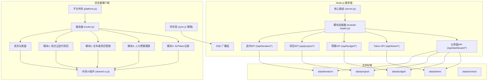
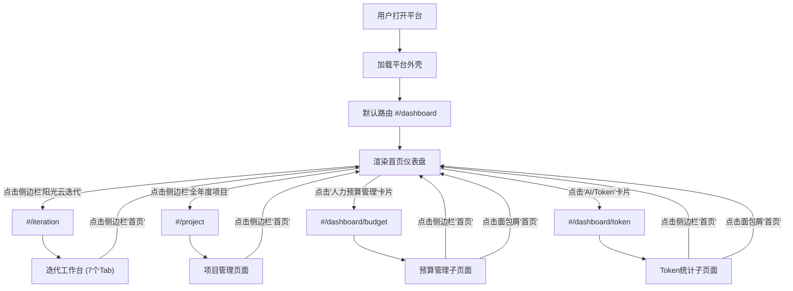
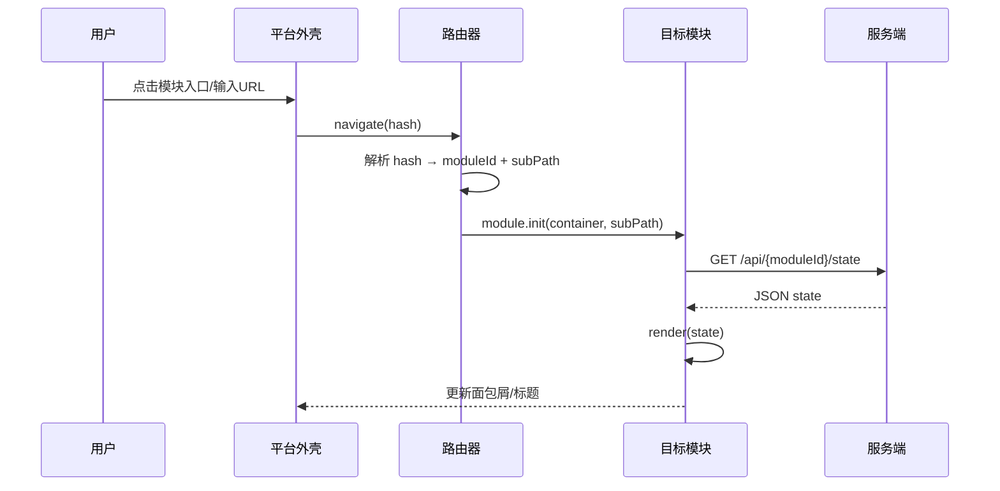
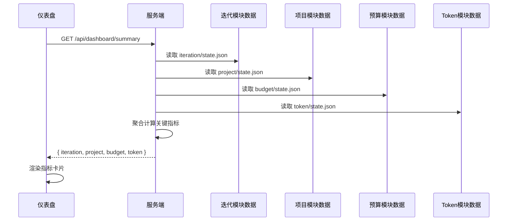
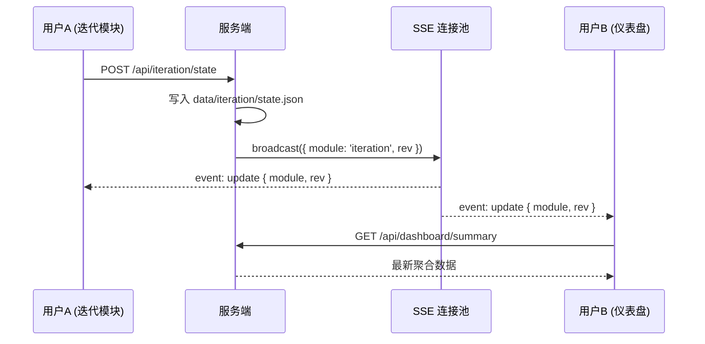

# Design Document: Platform Architecture Upgrade (平台架构升级)

## Overview

本设计将现有的「云平台人力产能工作台」从单功能迭代管理工具升级为多模块管理平台。平台采用「外壳 + 模块」架构：外壳提供统一的导航、路由、认证和共享基础设施；各业务模块（阳光云迭代项目、全年度项目管理、人力预算管理、AI/Token使用记录）作为独立单元注册到平台中，拥有各自的数据目录、API 路由和界面渲染逻辑。

核心设计原则：①向后兼容——现有迭代工作台功能完整保留；②渐进增强——模块可独立开发上线，平台外壳即使只有一个模块也能正常工作；③零依赖核心——服务端运行时不引入外部 npm 包；④文件存储——继续使用 JSON 文件，通过目录结构实现模块数据隔离。

## Architecture





## Frontend Layout Design (前端布局设计)

### Overall Layout Structure

采用经典的「左侧栏 + 顶部栏 + 主内容区」三区布局，左侧栏提供一级模块导航，顶部栏承载品牌标识与用户操作，主内容区根据路由渲染对应模块页面。

```
┌──────────────────────────────────────────────────────────────────┐
│  顶部导航栏 (Top Navbar, 48px)                                    │
│  ┌──────┐                              ┌────────────────────────┐│
│  │ Logo │  云平台管理工作台              │ 王明 | 🔔 通知 | ⚙ 设置││
│  └──────┘                              └────────────────────────┘│
├──────────┬───────────────────────────────────────────────────────┤
│          │                                                       │
│ 左侧栏    │              主内容区 (Main Content)                   │
│ (Sidebar │                                                       │
│  200px)  │  路由匹配到的模块页面在此渲染                            │
│          │                                                       │
│ ┌──────┐ │  ┌─────────────────────────────────────────────────┐  │
│ │🏠 首页│ │  │                                                 │  │
│ └──────┘ │  │   当前激活模块的视图                               │  │
│ ┌──────┐ │  │                                                 │  │
│ │📊 阳光│ │  │   - 首页 → 仪表盘 Dashboard                     │  │
│ │ 云迭代│ │  │   - 阳光云迭代 → 原有7个Tab工作台                 │  │
│ └──────┘ │  │   - 全年度项目 → 项目管理页面                     │  │
│ ┌──────┐ │  │   - 人力预算 → 预算管理子页                       │  │
│ │📋 全年│ │  │   - Token记录 → Token统计子页                    │  │
│ │ 度项目│ │  │                                                 │  │
│ └──────┘ │  └─────────────────────────────────────────────────┘  │
│          │                                                       │
└──────────┴───────────────────────────────────────────────────────┘
```

### Sidebar Design (侧边栏设计)

**导航项配置**：

| 顺序 | 图标 | 名称 | 路由 Hash | 说明 |
|------|------|------|-----------|------|
| 0 | 🏠 | 首页 | `#/dashboard` | 门户仪表盘 |
| 1 | 📊 | 阳光云迭代项目 | `#/iteration` | 现有迭代工作台（7个Tab） |
| 2 | 📋 | 全年度项目管理 | `#/project` | 年度项目台账 |

**侧边栏行为**：

- **固定显示**：侧边栏在桌面端始终可见，宽度 200px
- **折叠模式**：支持用户手动折叠为 56px 图标模式（仅显示图标，鼠标悬停显示 tooltip）
- **激活状态**：当前所在模块的导航项使用左侧蓝色条 + 背景高亮标识
- **子页面归属**：当用户在"人力预算管理"或"AI/Token记录"子页时，首页导航项仍保持激活状态（它们是首页的子路由）
- **徽章提示**：导航项右侧可显示数字徽章（如待办数量、告警数量）

```
┌────────────────────────┐
│  ☰  云平台             │ ← 折叠/展开按钮
├────────────────────────┤
│                        │
│  ▎🏠  首页          2  │ ← 激活态（左侧蓝条 + 高亮背景 + 待办徽章）
│                        │
│   📊  阳光云迭代项目    │ ← 普通态
│                        │
│   📋  全年度项目管理    │ ← 普通态
│                        │
├────────────────────────┤
│   ─ ─ ─ ─ ─ ─ ─ ─    │ ← 分隔线（底部功能区）
│   ⚙  系统设置          │
│   📖  使用帮助          │
└────────────────────────┘
```

**折叠态**：

```
┌──────┐
│  ☰   │
├──────┤
│ ▎🏠  │ ← 图标 + 左侧指示条
│  📊  │
│  📋  │
├──────┤
│  ⚙   │
│  📖  │
└──────┘
```

### Dashboard Page Design (首页仪表盘设计)

首页仪表盘是用户进入平台的第一个页面，提供全局概览和快速入口。

```
┌─────────────────────────────────────────────────────────────────┐
│                                                                 │
│  ┌─ Metric Cards Row (指标卡片行) ─────────────────────────────┐│
│  │                                                             ││
│  │ ┌──────────┐ ┌──────────┐ ┌──────────┐ ┌──────────┐       ││
│  │ │ 📊       │ │ 💰       │ │ 🤖       │ │ 📋       │       ││
│  │ │ 产能偏差  │ │ 预算执行率│ │ Token消耗│ │ 在研项目数│       ││
│  │ │          │ │          │ │          │ │          │       ││
│  │ │  +5.2%   │ │  78.3%   │ │  ¥85.5   │ │  12 个   │       ││
│  │ │  ⚠ 偏高  │ │  ✓ 正常  │ │  ✓ 正常  │ │  2个逾期  │       ││
│  │ └──────────┘ └──────────┘ └──────────┘ └──────────┘       ││
│  └─────────────────────────────────────────────────────────────┘│
│                                                                 │
│  ┌─ Module Entry Cards (模块入口卡片) ─────────────────────────┐│
│  │                                                             ││
│  │ ┌────────────────────────┐  ┌────────────────────────┐     ││
│  │ │ 💰 人力预算管理         │  │ 🤖 AI/Token 使用记录    │     ││
│  │ │                        │  │                        │     ││
│  │ │ 管理各团队人力预算计划    │  │ 查看AI Agent调用统计    │     ││
│  │ │ 实际用量跟踪与预警      │  │ Token消耗趋势分析       │     ││
│  │ │                        │  │                        │     ││
│  │ │         [进入 →]       │  │         [进入 →]       │     ││
│  │ └────────────────────────┘  └────────────────────────┘     ││
│  └─────────────────────────────────────────────────────────────┘│
│                                                                 │
│  ┌─ Quick Access Section (快速访问区) ─────────────────────────┐│
│  │                                                             ││
│  │ ┌─ 待办/告警 ────────┐  ┌─ 当月偏差概览 ────┐              ││
│  │ │ ⚠ 户用V3-开发完成   │  │                  │              ││
│  │ │   里程碑逾期 3天    │  │  APP开发  +8.2%  │              ││
│  │ │ ⚠ APP团队预算超10% │  │  后端开发  -2.1% │              ││
│  │ │ ○ Token预算使用80%  │  │  测试团队  +1.5% │              ││
│  │ └───────────────────┘  │  全部门    +5.2% │              ││
│  │                        └──────────────────┘              ││
│  │ ┌─ 最近归档记录 ───────────────────────┐                   ││
│  │ │ 📦 2026-6月 迭代归档  2026-07-02    │                   ││
│  │ │ 📦 2026-5月 迭代归档  2026-06-01    │                   ││
│  │ │ 📦 户用V2项目结项    2026-05-15     │                   ││
│  │ └─────────────────────────────────────┘                   ││
│  └─────────────────────────────────────────────────────────────┘│
│                                                                 │
└─────────────────────────────────────────────────────────────────┘
```

**指标卡片详细设计**：

| 卡片 | 数据源 | 数值格式 | 状态判断 |
|------|--------|----------|----------|
| 产能偏差 | `dashboard.iteration.deviation` | `±X.X%` | >10% ⚠ 偏高, <-10% ⚠ 偏低, 其他 ✓ 正常 |
| 预算执行率 | `dashboard.budget.rate` | `X.X%` | >100% ⚠ 超支, <60% ⚠ 偏低, 其他 ✓ 正常 |
| Token消耗 | `dashboard.token.monthlyCost` | `¥X.X` | >80%月预算 ⚠ 预警, 其他 ✓ 正常 |
| 在研项目数 | `dashboard.project.active` | `X 个` | 有逾期项目时 ⚠, 其他 ✓ 正常 |

**模块入口卡片**：

- 人力预算管理卡片 → 点击导航到 `#/dashboard/budget` 子页面
- AI/Token使用记录卡片 → 点击导航到 `#/dashboard/token` 子页面
- 卡片使用悬停阴影效果提示可点击
- 卡片内显示简短描述和一个"进入"按钮

**快速访问区**：

- **待办/告警**：合并展示逾期里程碑(来自project模块)、预算告警(来自budget模块)、Token预警(来自token模块)，最多显示5条，有更多时显示"查看全部"
- **当月偏差概览**：从iteration模块提取各团队当月偏差的迷你摘要列表
- **最近归档记录**：从archive目录读取最近3条归档记录

### Navigation Flow (导航流程)



**路由映射表**：

| URL Hash | 侧边栏激活项 | 面包屑 | 渲染内容 |
|----------|-------------|--------|----------|
| `#/dashboard` | 首页 | 首页 | 仪表盘主页 |
| `#/dashboard/budget` | 首页 | 首页 > 人力预算管理 | 预算管理全页面 |
| `#/dashboard/token` | 首页 | 首页 > AI/Token使用记录 | Token统计全页面 |
| `#/iteration` | 阳光云迭代项目 | 阳光云迭代项目 | 迭代工作台（原有7Tab） |
| `#/iteration/{tab}` | 阳光云迭代项目 | 阳光云迭代项目 > {Tab名} | 指定Tab页面 |
| `#/project` | 全年度项目管理 | 全年度项目管理 | 项目台账列表 |
| `#/project/detail/{id}` | 全年度项目管理 | 全年度项目管理 > 项目详情 | 项目详情页 |

### Responsive Behavior (响应式行为)

| 屏幕宽度 | 侧边栏行为 | 主内容区 |
|----------|-----------|----------|
| ≥ 1200px (桌面) | 展开态（200px），始终可见 | `calc(100% - 200px)` 宽度 |
| 768px - 1199px (平板/小桌面) | 折叠态（56px），仅图标 | `calc(100% - 56px)` 宽度 |
| < 768px (移动端) | 默认隐藏，通过汉堡菜单展开为 overlay | 100% 宽度 |

**折叠交互细节**：

- 桌面端：点击折叠按钮 `☰` 在展开(200px)和折叠(56px)之间切换，状态保存到 `localStorage`
- 平板端：默认折叠态，可手动展开，点击主内容区自动收回
- 移动端：汉堡按钮触发侧边栏作为 overlay 滑出，背景半透明遮罩，点击遮罩或导航项后自动收回
- 过渡动画：折叠/展开使用 CSS transition `width 0.2s ease`

### Page Transition (页面切换机制)

**模块切换流程**：

1. 用户点击侧边栏导航项或仪表盘内部链接
2. URL hash 变化触发 `hashchange` 事件
3. Router 解析新路由 → 确定 moduleId 和 subPath
4. 调用当前模块的 `leave()` 钩子（清理状态、解绑事件）
5. 隐藏当前模块容器（`display: none`）
6. 显示目标模块容器
7. 若模块首次激活 → 调用 `init(container, context)` 加载完整模块
8. 若模块已初始化 → 调用 `enter(subPath)` 切换子视图
9. 更新侧边栏激活状态和面包屑

**现有迭代工作台集成方式**：

- 原有 `app.js` 重构为 `IterationModule`，实现 ModuleDefinition 接口
- 原有 7 个 Tab（产能概览、偏差分析、通讯录等）作为迭代模块内部的子路由
- Tab 切换逻辑保留在模块内部，侧边栏仅显示模块级入口
- 路由格式：`#/iteration/{tab-name}`（如 `#/iteration/analysis`）

**容器管理策略**：

```html
<div id="app-container">
  <aside id="sidebar">...</aside>
  <main id="main-content">
    <div id="module-dashboard" class="module-view active">...</div>
    <div id="module-iteration" class="module-view hidden">...</div>
    <div id="module-project" class="module-view hidden">...</div>
  </main>
</div>
```

- 所有模块容器预创建，通过 CSS class 切换可见性
- 已初始化的模块保留 DOM 状态（避免重复渲染），仅在 `enter()` 时刷新数据
- 仪表盘子页面（预算、Token）作为 Dashboard 模块内部的子视图渲染

### Sub-page Design (子页面设计)

#### 人力预算管理页面 (`#/dashboard/budget`)

从首页仪表盘"人力预算管理"卡片点击进入，渲染在主内容区。

```
┌─────────────────────────────────────────────────────────────┐
│ 面包屑: 首页 > 人力预算管理                    [导出Excel]    │
├─────────────────────────────────────────────────────────────┤
│                                                             │
│ ┌─ 年度预算计划表 ─────────────────────────────────────────┐│
│ │ 团队          │ Q1计划 │ Q2计划 │ Q3计划 │ Q4计划 │ 年均 ││
│ │───────────────│────────│────────│────────│────────│──────││
│ │ APP开发-阳光云 │ 15人   │ 16人   │ 17人   │ 16人   │ 16人 ││
│ │ 后端开发-阳光云│ 20人   │ 21人   │ 22人   │ 21人   │ 21人 ││
│ │ 测试-阳光云    │ 8人    │ 9人    │ 9人    │ 8人    │ 8.5人││
│ │ ...           │        │        │        │        │      ││
│ └───────────────────────────────────────────────────────────┘│
│                                                             │
│ ┌─ 当月实际 vs 计划对比 ──────────────────────────────────┐  │
│ │                                                         │  │
│ │ [柱状图: 各团队 计划人数(浅色) vs 实际人数(深色)]          │  │
│ │                                                         │  │
│ │ APP开发  ████████████ 15    ████████████████ 16 ⚠ +6.7% │  │
│ │ 后端开发 ████████████████████ 20  ███████████████████ 19  │  │
│ │ 测试     ████████ 8    ████████ 8                        │  │
│ │                                                         │  │
│ └─────────────────────────────────────────────────────────┘  │
│                                                             │
│ ┌─ 预算告警 ─────────────────────────────────────────────┐  │
│ │ ⚠ APP开发-阳光云 7月外包人数超预算 12%                    │  │
│ │ ○ 后端开发-阳光云 本月预算使用正常                        │  │
│ └─────────────────────────────────────────────────────────┘  │
│                                                             │
└─────────────────────────────────────────────────────────────┘
```

**页面功能**：
- 年度预算计划表：可编辑单元格，修改后自动保存（调用 `/api/budget/state` POST）
- 实际 vs 计划对比图：使用 CSS 绘制的简易柱状图（保持零依赖）
- 预算告警列表：从 `budget.alerts` 数据渲染，超阈值项高亮
- 导出 Excel：复用现有 xlsx 导出能力

#### AI/Token 使用记录页面 (`#/dashboard/token`)

从首页仪表盘"AI/Token使用记录"卡片点击进入。

```
┌─────────────────────────────────────────────────────────────┐
│ 面包屑: 首页 > AI/Token 使用记录       [月份选择: 2026-07 ▾] │
├─────────────────────────────────────────────────────────────┤
│                                                             │
│ ┌─ 月度汇总 ─────────────────────────────────────────────┐  │
│ │ 总Token: 1,250,000  总花费: ¥85.5  调用次数: 342       │  │
│ │ 月预算: ¥500  已使用: 17.1%  ─────○─────────────       │  │
│ └─────────────────────────────────────────────────────────┘  │
│                                                             │
│ ┌─ Agent 使用排行 ───────────────────────────────────────┐  │
│ │ 排名 │ Agent名称      │ 调用次数 │ Token数   │ 花费    ││
│ │──────│───────────────│─────────│──────────│─────────││
│ │  1   │ 代码审查助手   │ 156     │ 580,000  │ ¥39.2   ││
│ │  2   │ 需求分析助手   │ 98      │ 420,000  │ ¥28.4   ││
│ │  3   │ 测试生成助手   │ 88      │ 250,000  │ ¥17.9   ││
│ └───────────────────────────────────────────────────────────┘│
│                                                             │
│ ┌─ 每日消耗趋势 ─────────────────────────────────────────┐  │
│ │                                                         │  │
│ │  ¥5 │        ╭─╮                                       │  │
│ │  ¥4 │     ╭──╯ ╰──╮     ╭─╮                           │  │
│ │  ¥3 │  ╭──╯       ╰──╮──╯ ╰─╮                         │  │
│ │  ¥2 │──╯              ╰──────╰──                       │  │
│ │  ¥1 │                                                  │  │
│ │     └──────────────────────────────                    │  │
│ │       7/1  7/5  7/10  7/15  7/20  7/25  7/28          │  │
│ │                                                         │  │
│ └─────────────────────────────────────────────────────────┘  │
│                                                             │
│ ┌─ 最近调用明细 ─────────────────────────────────────────┐  │
│ │ 时间           │ Agent      │ 项目         │ Token │ 花费││
│ │────────────────│────────────│──────────────│───────│─────││
│ │ 07-28 14:30   │ 代码审查    │ 户用V3升级   │ 4,500 │¥0.31││
│ │ 07-28 11:15   │ 需求分析    │ 电站监控V2   │ 3,200 │¥0.22││
│ │ ...           │            │              │       │     ││
│ └───────────────────────────────────────────────────────────┘│
│                                                             │
└─────────────────────────────────────────────────────────────┘
```

**页面功能**：
- 月度汇总栏：显示当月总消耗和预算进度条
- Agent排行表：按花费降序排列各AI Agent的使用统计
- 每日趋势图：使用 CSS/SVG 绘制简易折线图，展示每日花费走势
- 调用明细表：分页显示每条调用记录，支持按日期筛选
- 月份选择器：切换查看不同月份的统计数据


## Sequence Diagrams

### 模块加载与路由切换



### 仪表盘数据聚合



### 跨模块 SSE 事件广播




## Components and Interfaces

### Component 1: 平台外壳 (Platform Shell)

**Purpose**: 提供统一的三区布局（顶部导航栏 + 固定左侧栏 + 主内容区），管理模块容器、面包屑、用户标识和全局通知。作为所有模块的容器框架。

**Interface**:
```javascript
// platform.js
const Platform = {
  // 初始化平台，注册所有模块，渲染侧边栏和顶部栏
  init(modules) {},
  
  // 获取当前已注册模块列表
  getModules() {},
  
  // 显示全局 toast 通知
  toast(message, type = 'info') {},
  
  // 更新顶部面包屑
  setBreadcrumb(items) {},
  
  // 获取当前用户标识
  whoami() {},
  
  // 获取平台配置
  getConfig() {},
  
  // 切换侧边栏折叠/展开状态
  toggleSidebar() {},
  
  // 获取侧边栏当前状态 ('expanded' | 'collapsed' | 'hidden')
  getSidebarState() {},
  
  // 更新导航项徽章数字
  setBadge(moduleId, count) {},
  
  // 更新连接状态指示器
  updateConnectionStatus(status) {}
};
```

**Responsibilities**:
- 渲染顶部导航栏（48px 高度：品牌Logo、平台标题、用户名、通知铃铛、设置入口）
- 渲染固定左侧栏（200px 宽度，含折叠/展开切换、模块导航项列表、底部功能区）
- 管理侧边栏状态：桌面展开(200px)↔折叠(56px)切换，移动端 overlay 模式
- 侧边栏导航项渲染：图标 + 名称 + 可选徽章，激活项左侧蓝色指示条 + 背景高亮
- 管理主内容区模块容器（预创建所有模块的 div，通过 class 切换显示/隐藏）
- 管理全局通知 toast
- 维护面包屑导航状态（顶部栏下方或主内容区顶部）
- 提供用户身份标识（复用现有 whoami 机制）
- 响应式处理：监听窗口 resize 事件自动调整侧边栏模式
- 侧边栏折叠偏好持久化到 localStorage

### Component 2: 路由器 (Router)

**Purpose**: 基于 URL hash 实现模块级别和模块内部的页面导航，支持浏览器前进/后退。

**Interface**:
```javascript
// router.js
const Router = {
  // 初始化路由，绑定 hashchange 监听
  init(moduleMap) {},
  
  // 编程式导航
  navigate(path) {},
  
  // 获取当前路由信息
  current() {},
  
  // 注册路由变化回调
  onChange(callback) {}
};

// 路由格式: #/{moduleId}/{subPath}
// 示例: #/dashboard, #/iteration/analysis, #/project/list
```

**Responsibilities**:
- 解析 URL hash 为 moduleId + subPath
- 触发对应模块的视图切换
- 维护导航历史栈
- 首次加载时根据 hash 激活正确模块

### Component 3: 模块注册接口 (Module Registry)

**Purpose**: 定义每个业务模块必须实现的标准接口，使平台外壳能统一管理模块生命周期。

**Interface**:
```javascript
// 每个模块必须导出的接口
const ModuleDefinition = {
  id: 'iteration',           // 模块唯一标识，用于路由和数据目录
  name: '阳光云迭代项目',     // 显示名称
  icon: '📊',               // 模块图标
  order: 1,                  // 侧边栏排序
  
  // 模块初始化：首次进入时调用
  init(container, context) {},
  
  // 路由进入：每次导航到该模块时调用
  enter(subPath) {},
  
  // 路由离开：导航离开该模块时调用
  leave() {},
  
  // 返回仪表盘需要的摘要指标
  getSummary() {},
  
  // 返回模块内的子导航项（用于侧边栏展开）
  getNavItems() {}
};
```

**Responsibilities**:
- 定义模块生命周期钩子（init/enter/leave）
- 提供仪表盘数据聚合接口
- 声明模块元数据（名称、图标、排序）
- 支持模块内子导航


### Component 4: 服务端模块加载器 (Server Module Loader)

**Purpose**: 在服务端动态加载各模块的路由处理器，避免 server.js 膨胀。每个模块提供自己的路由注册函数。

**Interface**:
```javascript
// module-loader.js
const ModuleLoader = {
  // 扫描 modules/ 目录，加载各模块的 routes.js
  loadAll(server) {},
  
  // 手动注册单个模块
  register(moduleId, routeHandler) {},
  
  // 获取已注册模块列表
  list() {}
};

// 每个服务端模块导出的接口 (modules/{id}/routes.js)
module.exports = {
  id: 'project',
  prefix: '/api/project',
  
  // 路由处理函数，接收 (req, res, parsedUrl)
  handle(req, res, url) {},
  
  // 模块数据目录初始化
  ensureData() {}
};
```

**Responsibilities**:
- 启动时自动发现和加载 `modules/` 下的各模块
- 按 URL 前缀分发请求到对应模块
- 每个模块独立管理自己的 JSON 数据文件
- 提供模块间最小化的通信接口（用于仪表盘聚合）

### Component 5: 增强同步层 (Enhanced Sync Layer)

**Purpose**: 扩展现有 sync.js 支持多模块的 SSE 事件，每个模块独立 rev 追踪。

**Interface**:
```javascript
// sync.js 增强
const Sync = {
  // 原有接口保持不变
  init(handlers) {},
  push(getState) {},
  
  // 新增：指定模块的状态推送
  pushModule(moduleId, getState) {},
  
  // 新增：订阅特定模块的远程变更
  onModuleUpdate(moduleId, callback) {},
  
  // 属性
  get mode() {},
  get online() {},
  get modules() {}  // 新增：各模块的 rev 状态
};
```

**Responsibilities**:
- SSE 事件携带 moduleId 字段，客户端按模块过滤
- 每个模块独立的乐观锁 rev
- 断连暂存按模块分离存储
- 向后兼容：无 moduleId 的事件默认归属 iteration 模块


## Data Models

### 数据目录结构

```
data/
├── iteration/           # 模块1: 阳光云迭代项目 (原 state.json 迁移至此)
│   ├── state.json       # 当前迭代状态
│   └── history/         # 变更快照
├── project/             # 模块2: 全年度项目管理
│   ├── state.json       # 项目台账
│   └── history/
├── budget/              # 模块3: 人力预算管理
│   ├── state.json       # 预算数据
│   └── history/
├── token/               # 模块4: AI/Token使用记录
│   ├── state.json       # Token统计
│   ├── logs/            # 每日调用日志
│   └── history/
├── archive/             # 跨模块归档（保留原位置）
│   └── *.json
└── platform.json        # 平台级配置（模块启用状态等）
```

### Model 1: 平台配置 (platform.json)

```javascript
const PlatformConfig = {
  version: '2.0.0',
  modules: {
    iteration: { enabled: true, order: 1 },
    project:   { enabled: true, order: 2 },
    budget:    { enabled: true, order: 3 },
    token:     { enabled: true, order: 4 }
  },
  theme: 'light',
  locale: 'zh-CN'
};
```

**Validation Rules**:
- version 必须为 semver 格式字符串
- modules 中至少有一个 enabled: true
- order 值不重复

### Model 2: 全年度项目台账 (project/state.json)

```javascript
const ProjectState = {
  rev: 0,
  updatedAt: '',
  updatedBy: '',
  year: 2026,
  projects: [
    {
      id: 'proj-001',
      name: '户用监控V3升级',
      productLine: '户用及分布式监控',
      status: 'in-progress',    // planned | in-progress | completed | suspended
      priority: 'high',         // high | medium | low
      owner: '张三',
      startDate: '2026-03',
      endDate: '2026-08',
      milestones: [
        { name: '需求评审', date: '2026-03-15', status: 'done' },
        { name: '开发完成', date: '2026-06-30', status: 'in-progress' },
        { name: '上线', date: '2026-08-13', status: 'pending' }
      ],
      resourceSummary: {
        totalManDays: 480,
        usedManDays: 320,
        teams: { 'APP开发-阳光云': 120, '后端开发-阳光云': 200 }
      },
      iterations: ['2026-7月', '2026-8月'],  // 关联的迭代
      note: ''
    }
  ]
};
```

**Validation Rules**:
- id 唯一且非空
- status 必须为枚举值之一
- startDate 不得晚于 endDate
- milestones 按 date 升序

### Model 3: 人力预算 (budget/state.json)

```javascript
const BudgetState = {
  rev: 0,
  updatedAt: '',
  updatedBy: '',
  year: 2026,
  plans: [
    {
      team: 'APP开发-阳光云',
      quarterly: [
        { q: 'Q1', regular: 12, outsource: 3, budget: 15 },
        { q: 'Q2', regular: 12, outsource: 4, budget: 16 },
        { q: 'Q3', regular: 13, outsource: 4, budget: 17 },
        { q: 'Q4', regular: 13, outsource: 3, budget: 16 }
      ],
      annual: { regular: 13, outsource: 3.5, budget: 16 }
    }
  ],
  actuals: [
    {
      team: 'APP开发-阳光云',
      month: '2026-07',
      regular: 12,
      outsource: 4,
      total: 16
    }
  ],
  alerts: [
    {
      team: 'APP开发-阳光云',
      month: '2026-07',
      type: 'over-budget',     // over-budget | under-utilized
      threshold: 0.1,
      actual: 0.12,
      message: '外包人数超预算 12%'
    }
  ]
};
```

**Validation Rules**:
- team 必须存在于 TEAMS 配置中
- quarterly 必须包含 Q1-Q4 四项
- actuals.month 格式为 YYYY-MM
- alerts.threshold 为 0-1 之间的小数

### Model 4: AI/Token 使用记录 (token/state.json)

```javascript
const TokenState = {
  rev: 0,
  updatedAt: '',
  updatedBy: '',
  summary: {
    totalTokens: 1250000,
    totalCost: 85.5,           // 单位：元
    totalInvocations: 342,
    period: { from: '2026-07-01', to: '2026-07-31' }
  },
  agents: [
    {
      id: 'code-review',
      name: '代码审查助手',
      invocations: 156,
      tokensUsed: 580000,
      cost: 39.2,
      lastUsed: '2026-07-28'
    }
  ],
  dailyLogs: [
    {
      date: '2026-07-28',
      entries: [
        {
          agent: 'code-review',
          team: 'APP开发-阳光云',
          project: '户用监控V3升级',
          tokens: 4500,
          cost: 0.31,
          timestamp: '2026-07-28T14:30:00'
        }
      ]
    }
  ],
  budgetLimit: {
    monthly: 500,              // 月度预算上限（元）
    alertThreshold: 0.8        // 达到80%时预警
  }
};
```

**Validation Rules**:
- tokens 和 cost 为非负数
- date 格式为 YYYY-MM-DD
- agent.id 唯一
- budgetLimit.alertThreshold 在 0-1 之间


## Algorithmic Pseudocode

### 路由解析与模块切换算法

```javascript
/**
 * ALGORITHM: parseAndNavigate
 * INPUT: hash (string) - URL hash fragment, e.g. "#/project/milestones"
 * OUTPUT: 激活对应模块并渲染子页面
 */
function parseAndNavigate(hash) {
  // PRECONDITION: hash starts with '#/' or is empty
  // POSTCONDITION: exactly one module is active and rendered

  const parts = hash.replace(/^#\/?/, '').split('/');
  const moduleId = parts[0] || 'dashboard';
  const subPath = parts.slice(1).join('/') || '';

  const module = registeredModules[moduleId];
  
  // 如果模块不存在或未启用，回退到首页
  if (!module || !module.enabled) {
    moduleId = 'dashboard';
    subPath = '';
  }

  // 通知当前活动模块执行离开钩子
  if (activeModule && activeModule.leave) {
    activeModule.leave();
  }

  // 切换容器可见性
  hideAllModuleContainers();
  showModuleContainer(moduleId);

  // 激活新模块
  activeModule = module;
  if (!module.initialized) {
    module.init(getContainer(moduleId), { subPath, platform: Platform });
    module.initialized = true;
  } else {
    module.enter(subPath);
  }

  // 更新导航状态
  Platform.setBreadcrumb(buildBreadcrumb(moduleId, subPath));
  highlightNavItem(moduleId);
}
```

### 服务端模块路由分发算法

```javascript
/**
 * ALGORITHM: dispatchRequest
 * INPUT: req (HTTP request), res (HTTP response)
 * OUTPUT: 请求被路由到对应模块处理器或静态文件
 */
function dispatchRequest(req, res) {
  const url = parseUrl(req.url);
  const pathname = url.pathname;

  // PRECONDITION: req is a valid HTTP request
  // POSTCONDITION: response is sent exactly once

  // 1. 全局中间件：认证检查
  if (ACCESS_TOKEN && !verifyToken(req, url)) {
    return sendUnauthorized(res);
  }

  // 2. SSE 订阅（全局，不分模块）
  if (pathname === '/api/events') {
    return handleSSE(req, res);
  }

  // 3. 仪表盘聚合API
  if (pathname.startsWith('/api/dashboard/')) {
    return dashboardHandler.handle(req, res, url);
  }

  // 4. 按前缀分发到各模块
  for (const mod of loadedModules) {
    if (pathname.startsWith(mod.prefix)) {
      return mod.handle(req, res, url);
    }
  }

  // 5. 兼容旧路径：/api/state → 转发到迭代模块
  if (pathname === '/api/state') {
    return iterationModule.handle(req, res, url);
  }

  // 6. 静态文件
  return serveStatic(req, res, pathname);
}
```

### 仪表盘数据聚合算法

```javascript
/**
 * ALGORITHM: aggregateDashboard
 * INPUT: none (从各模块数据文件读取)
 * OUTPUT: 仪表盘摘要对象
 */
function aggregateDashboard() {
  // PRECONDITION: 各模块数据文件可读
  // POSTCONDITION: 返回包含所有模块关键指标的聚合对象

  const iterState = readModuleState('iteration');
  const projState = readModuleState('project');
  const budgetState = readModuleState('budget');
  const tokenState = readModuleState('token');

  // 迭代偏差 — 复用现有 compute() 逻辑
  const iterResult = compute(iterState);
  const overallDeviation = iterResult.totals.capacity
    ? (iterResult.totals.workload - iterResult.totals.capacity) / iterResult.totals.capacity
    : 0;

  // 项目进度
  const projects = projState.projects || [];
  const activeProjects = projects.filter(p => p.status === 'in-progress').length;
  const overdueProjects = projects.filter(p => 
    p.status === 'in-progress' && isOverdue(p)
  ).length;

  // 预算执行率
  const currentMonth = getCurrentMonth();
  const budgetActuals = (budgetState.actuals || [])
    .filter(a => a.month === currentMonth);
  const totalActual = budgetActuals.reduce((s, a) => s + a.total, 0);
  const totalBudget = (budgetState.plans || [])
    .reduce((s, p) => s + getCurrentQuarterBudget(p), 0);
  const budgetRate = totalBudget ? totalActual / totalBudget : 0;

  // Token消耗
  const tokenSummary = tokenState.summary || {};

  return {
    iteration: {
      cycleName: iterResult.cycle ? iterResult.cycle.name : '—',
      deviation: overallDeviation,
      days: iterResult.days,
      workload: iterResult.totals.workload,
      capacity: iterResult.totals.capacity
    },
    project: {
      total: projects.length,
      active: activeProjects,
      overdue: overdueProjects
    },
    budget: {
      rate: budgetRate,
      alerts: (budgetState.alerts || []).length
    },
    token: {
      monthlyTokens: tokenSummary.totalTokens || 0,
      monthlyCost: tokenSummary.totalCost || 0,
      invocations: tokenSummary.totalInvocations || 0
    },
    updatedAt: new Date().toLocaleString('zh-CN')
  };
}
```


### 数据迁移算法（向后兼容）

```javascript
/**
 * ALGORITHM: migrateDataLayout
 * INPUT: 旧版 data/ 目录结构
 * OUTPUT: 新版分模块目录结构，旧数据完整保留
 * 
 * 迁移策略：首次启动新版时自动检测并迁移
 */
function migrateDataLayout() {
  // PRECONDITION: data/ 目录存在
  // POSTCONDITION: 旧数据迁移到 data/iteration/，原位置保留符号链接（兼容期）

  const oldStateFile = path.join(DATA_DIR, 'state.json');
  const newIterDir = path.join(DATA_DIR, 'iteration');
  const newStateFile = path.join(newIterDir, 'state.json');

  // 已迁移过则跳过
  if (fs.existsSync(newStateFile)) return { migrated: false };

  // 创建新目录结构
  ensureDir(newIterDir);
  ensureDir(path.join(newIterDir, 'history'));

  // 迁移 state.json
  if (fs.existsSync(oldStateFile)) {
    fs.copyFileSync(oldStateFile, newStateFile);
  }

  // 迁移 history/ 目录下的快照
  const oldHistoryDir = path.join(DATA_DIR, 'history');
  if (fs.existsSync(oldHistoryDir)) {
    const files = fs.readdirSync(oldHistoryDir);
    files.forEach(f => {
      fs.copyFileSync(
        path.join(oldHistoryDir, f),
        path.join(newIterDir, 'history', f)
      );
    });
  }

  // 在旧位置写入重定向标记（便于旧版客户端提示升级）
  fs.writeFileSync(oldStateFile, JSON.stringify({
    _migrated: true,
    _message: '数据已迁移至 data/iteration/，请更新客户端',
    _migratedAt: new Date().toISOString()
  }));

  // 初始化其他模块的空 state
  ['project', 'budget', 'token'].forEach(mod => {
    const dir = path.join(DATA_DIR, mod);
    ensureDir(dir);
    ensureDir(path.join(dir, 'history'));
    const stateFile = path.join(dir, 'state.json');
    if (!fs.existsSync(stateFile)) {
      fs.writeFileSync(stateFile, JSON.stringify(
        getEmptyState(mod), null, 2
      ));
    }
  });

  return { migrated: true, modules: ['iteration', 'project', 'budget', 'token'] };
}
```


## Key Functions with Formal Specifications

### Function 1: Platform.init()

```javascript
function init(modules) {
  // 注册模块、渲染外壳、绑定路由
}
```

**Preconditions:**
- `modules` 是非空数组
- 每个模块对象实现 ModuleDefinition 接口
- DOM 已加载完毕 (DOMContentLoaded)

**Postconditions:**
- 所有模块已注册到 registeredModules 映射表
- 侧边栏已渲染模块入口
- hashchange 事件已绑定
- 根据当前 URL hash 激活了对应模块

**Loop Invariants:** N/A

### Function 2: Router.navigate()

```javascript
function navigate(path) {
  // 更新 hash 触发路由变化
  window.location.hash = '#/' + path;
}
```

**Preconditions:**
- `path` 为字符串，格式 `{moduleId}` 或 `{moduleId}/{subPath}`
- moduleId 对应的模块已注册

**Postconditions:**
- URL hash 已更新为 `#/{path}`
- 对应模块已激活并渲染
- 前一个活动模块的 leave() 已调用
- 面包屑已更新

**Loop Invariants:** N/A

### Function 3: ModuleLoader.loadAll()

```javascript
function loadAll(server) {
  // 扫描 modules/ 目录并注册路由
}
```

**Preconditions:**
- `modules/` 目录存在
- 每个子目录包含 `routes.js` 且导出合法的模块对象
- server 实例已创建但未开始监听

**Postconditions:**
- 所有有效模块已加载到 loadedModules 数组
- 每个模块的 prefix 唯一
- 模块按 prefix 长度降序排列（最长匹配优先）
- 各模块的 ensureData() 已调用，数据目录已就绪

**Loop Invariants:**
- 遍历 modules/ 子目录时，已加载的模块的 prefix 互不冲突

### Function 4: Sync.pushModule()

```javascript
function pushModule(moduleId, getState) {
  // 向特定模块端点提交状态变更
}
```

**Preconditions:**
- `moduleId` 为已注册模块的 id
- `getState` 为无参函数，返回当前模块状态对象
- 同步层已初始化 (init 已调用)

**Postconditions:**
- 若在线：状态已提交到 `/api/{moduleId}/state`，rev 已递增
- 若离线：状态已暂存到 `localStorage` 的模块专属 key
- 冲突时返回 `{ conflict: true, server, base, mine }` 供调用方合并

**Loop Invariants:** N/A

### Function 5: aggregateDashboard()

```javascript
function aggregateDashboard() {
  // 从各模块读取状态并计算汇总指标
}
```

**Preconditions:**
- 各模块的 `state.json` 文件存在且可解析
- `config.js` 已加载（compute() 依赖全局变量）

**Postconditions:**
- 返回对象包含 iteration, project, budget, token 四个子对象
- 每个子对象的数值字段为有限数（不为 NaN 或 Infinity）
- 若某模块数据文件缺失或解析失败，对应子对象使用零值填充（不抛异常）

**Loop Invariants:** N/A


## Example Usage

### 客户端：注册模块并初始化平台

```javascript
// main.js - 新的入口文件
document.addEventListener('DOMContentLoaded', () => {
  // 注册所有模块
  const modules = [
    IterationModule,    // 原 app.js 重构为模块
    ProjectModule,      // 全年度项目管理
    BudgetModule,       // 人力预算管理
    TokenModule         // AI/Token 使用记录
  ];

  // 初始化平台外壳
  Platform.init(modules);

  // 初始化同步层（增强版支持多模块）
  Sync.init({
    onRemote: (moduleId, state, by) => {
      const mod = Platform.getModule(moduleId);
      if (mod && mod.onRemoteUpdate) mod.onRemoteUpdate(state, by);
    },
    onStatus: (status) => Platform.updateConnectionStatus(status),
    onRecover: (moduleId, remote, pending) => {
      const mod = Platform.getModule(moduleId);
      if (mod && mod.onRecover) mod.onRecover(remote, pending);
    }
  });

  // 路由初始化 — 激活 URL hash 对应的模块
  Router.init(Platform.getModules());
});
```

### 服务端：模块路由注册

```javascript
// modules/project/routes.js
const fs = require('fs');
const path = require('path');

const DATA_DIR = process.env.DATA_DIR || path.join(__dirname, '../../data');
const STATE_FILE = path.join(DATA_DIR, 'project/state.json');

module.exports = {
  id: 'project',
  prefix: '/api/project',

  ensureData() {
    const dir = path.join(DATA_DIR, 'project');
    if (!fs.existsSync(dir)) fs.mkdirSync(dir, { recursive: true });
    if (!fs.existsSync(STATE_FILE)) {
      fs.writeFileSync(STATE_FILE, JSON.stringify({
        rev: 0, year: new Date().getFullYear(), projects: []
      }, null, 2));
    }
  },

  handle(req, res, url) {
    const sub = url.pathname.replace('/api/project', '');

    if (sub === '/state' && req.method === 'GET') {
      const state = JSON.parse(fs.readFileSync(STATE_FILE, 'utf8'));
      return sendJson(res, 200, state);
    }

    if (sub === '/state' && req.method === 'POST') {
      // 乐观锁逻辑与现有 /api/state 一致
      return handleStateUpdate(req, res, STATE_FILE, 'project');
    }

    if (sub === '/milestones' && req.method === 'GET') {
      const state = JSON.parse(fs.readFileSync(STATE_FILE, 'utf8'));
      const milestones = extractUpcomingMilestones(state);
      return sendJson(res, 200, milestones);
    }

    sendJson(res, 404, { error: 'Not Found' });
  }
};
```

### 仪表盘渲染示例

```javascript
// modules/dashboard/index.js (客户端)
const DashboardModule = {
  id: 'dashboard',
  name: '首页',
  icon: '🏠',
  order: 0,

  init(container) {
    this.container = container;
    this.render();
  },

  enter() { this.render(); },

  async render() {
    const data = await fetch('/api/dashboard/summary').then(r => r.json());
    
    this.container.innerHTML = `
      <div class="dashboard">
        <h1>云平台管理工作台</h1>
        <div class="metric-cards">
          ${this.renderCard('📊', '产能偏差', this.formatPct(data.iteration.deviation), 
            data.iteration.deviation > 0.1 ? 'warn' : 'ok')}
          ${this.renderCard('📋', '在研项目', data.project.active + ' 个',
            data.project.overdue > 0 ? 'warn' : 'ok')}
          ${this.renderCard('💰', '预算执行率', this.formatPct(data.budget.rate), 
            data.budget.alerts > 0 ? 'warn' : 'ok')}
          ${this.renderCard('🤖', 'Token消耗', '¥' + data.token.monthlyCost.toFixed(1), 'info')}
        </div>
        <div class="module-entries">
          ${Platform.getModules().filter(m => m.id !== 'dashboard').map(m => `
            <a class="module-card" href="#/${m.id}">
              <span class="module-icon">${m.icon}</span>
              <span class="module-name">${m.name}</span>
            </a>
          `).join('')}
        </div>
      </div>`;
  },

  renderCard(icon, label, value, status) {
    return `<div class="metric-card ${status}">
      <div class="metric-icon">${icon}</div>
      <div class="metric-label">${label}</div>
      <div class="metric-value">${value}</div>
    </div>`;
  },

  formatPct(v) { return (v * 100).toFixed(1) + '%'; }
};
```


## Correctness Properties

### 属性1：模块隔离性

```javascript
// 任意模块的数据变更不会影响其他模块的数据
// ∀ moduleA, moduleB where moduleA.id ≠ moduleB.id:
//   pushModule(moduleA.id, stateA) does NOT modify readModuleState(moduleB.id)
assert(
  pushModule('project', newProjectState) &&
  readModuleState('iteration') === previousIterationState
);
```

### 属性2：路由确定性

```javascript
// 相同的 URL hash 总是激活相同的模块和子路径
// ∀ hash: parseAndNavigate(hash) → (moduleId, subPath) 是纯函数
const result1 = parseRoute('#/project/milestones');
const result2 = parseRoute('#/project/milestones');
assert(result1.moduleId === result2.moduleId);
assert(result1.subPath === result2.subPath);
```

### 属性3：向后兼容性

```javascript
// 旧版 /api/state 端点行为完全不变
// ∀ request to /api/state:
//   response is identical to pre-upgrade behavior
const oldResponse = legacyServer.handle('GET /api/state');
const newResponse = newServer.handle('GET /api/state');
assert(deepEqual(oldResponse, newResponse));
```

### 属性4：断连暂存可靠性

```javascript
// 离线期间的每次变更都被暂存，恢复后无数据丢失
// ∀ moduleId, offline period [t0, t1]:
//   all pushModule() calls during [t0, t1] are recoverable
const changesDuringOffline = getChangesBetween(t0, t1);
goOnline();
const serverState = readModuleState(moduleId);
assert(changesDuringOffline.every(change => isReflectedIn(change, serverState)));
```

### 属性5：仪表盘数据一致性

```javascript
// 仪表盘显示的指标与各模块实际数据一致
// ∀ time t: dashboard.iteration.deviation === compute(readModuleState('iteration')).overallDeviation
const dashData = await fetch('/api/dashboard/summary').then(r => r.json());
const iterState = await fetch('/api/iteration/state').then(r => r.json());
const computed = compute(iterState);
const expected = computed.totals.capacity 
  ? (computed.totals.workload - computed.totals.capacity) / computed.totals.capacity 
  : 0;
assert(Math.abs(dashData.iteration.deviation - expected) < 0.001);
```


## Error Handling

### Error Scenario 1: 模块加载失败

**Condition**: `modules/{id}/routes.js` 文件不存在或导出格式不正确
**Response**: 记录警告日志，跳过该模块，继续加载其他模块
**Recovery**: 平台正常启动，缺失模块在侧边栏显示为灰色不可点击状态，仪表盘对应卡片显示「模块未就绪」

### Error Scenario 2: 模块数据文件损坏

**Condition**: 某模块的 `state.json` 无法解析为合法 JSON
**Response**: 尝试从 `history/` 目录回退到最近一个可用快照（复用现有的 latestSnapshot 逻辑）
**Recovery**: 若回退成功，使用快照数据继续运行并记录告警；若无可用快照，使用空态初始化该模块并通知用户

### Error Scenario 3: 跨模块数据聚合异常

**Condition**: 仪表盘聚合时某个模块返回异常数据（null、格式错误等）
**Response**: 该模块的指标使用默认零值填充，不影响其他模块的指标展示
**Recovery**: 仪表盘在对应卡片上显示「数据异常」标识，不阻塞整体渲染

### Error Scenario 4: 多模块并发写入冲突

**Condition**: 两个用户同时修改同一模块的 state（乐观锁 rev 冲突）
**Response**: 返回 409，携带服务端最新 state 和 rev
**Recovery**: 客户端触发三方合并（复用现有 mergeStates 逻辑），合并结果自动重提交

### Error Scenario 5: SSE 连接断开后恢复

**Condition**: 网络中断导致 SSE 连接断开，客户端进入离线模式
**Response**: 各模块的变更独立暂存到 localStorage（按 moduleId 分 key）
**Recovery**: 重连后逐模块检查暂存，有暂存则逐个执行三方合并补交

### Error Scenario 6: 数据迁移中断

**Condition**: 首次升级时迁移数据过程中进程被终止
**Response**: 下次启动时检测到不完整迁移状态（旧文件存在但新目录不完整）
**Recovery**: 重新执行完整迁移流程（迁移操作幂等，已存在的文件跳过）


## Testing Strategy

### Unit Testing Approach

**关键测试用例**：

1. **路由解析器** — 验证各种 hash 格式正确解析为 moduleId + subPath
   - `#/` → dashboard + ''
   - `#/project/milestones` → project + 'milestones'
   - `#/iteration/analysis` → iteration + 'analysis'
   - 无效模块名 → 回退 dashboard

2. **模块加载器** — 验证模块注册、前缀冲突检测、加载失败容错
   - 正常模块注册并可通过 prefix 匹配
   - 重复 prefix 注册报错
   - routes.js 语法错误时跳过该模块不崩溃

3. **仪表盘聚合** — 验证各模块指标正确计算
   - 所有模块正常时返回完整数据
   - 某模块数据缺失时对应字段为零值
   - 计算结果与各模块独立计算一致

4. **数据迁移** — 验证旧数据正确迁移到新目录结构
   - 全新安装时创建空目录
   - 有旧数据时正确复制
   - 迁移幂等（多次执行结果一致）

### Property-Based Testing Approach

**Property Test Library**: fast-check (或手写随机生成器，保持零依赖)

**核心属性**：

1. **路由往返性 (Round-trip)**
   ```javascript
   // ∀ moduleId ∈ registeredModules, ∀ subPath ∈ validPaths:
   //   buildHash(moduleId, subPath) |> parseRoute === { moduleId, subPath }
   fc.assert(fc.property(
     fc.constantFrom(...moduleIds),
     fc.stringOf(fc.constantFrom(...'abcdefghijklmnop/'), { maxLength: 20 }),
     (modId, sub) => {
       const hash = '#/' + modId + (sub ? '/' + sub : '');
       const parsed = parseRoute(hash);
       return parsed.moduleId === modId;
     }
   ));
   ```

2. **模块隔离性**
   ```javascript
   // ∀ moduleA ≠ moduleB, ∀ state:
   //   写入 moduleA 不改变 moduleB 的读取结果
   fc.assert(fc.property(
     fc.constantFrom(...moduleIds),
     fc.constantFrom(...moduleIds),
     fc.jsonObject(),
     (modA, modB, data) => {
       if (modA === modB) return true;
       const beforeB = readModuleState(modB);
       writeModuleState(modA, data);
       const afterB = readModuleState(modB);
       return deepEqual(beforeB, afterB);
     }
   ));
   ```

3. **乐观锁单调递增**
   ```javascript
   // ∀ successful writes: resulting rev > previous rev
   // 每次成功写入后 rev 严格递增
   ```

### Integration Testing Approach

1. **端到端路由测试** — 启动服务，验证 `/api/{module}/state` 各端点返回正确数据
2. **SSE 多客户端测试** — 模拟两个客户端连接，验证一方写入后另一方收到广播事件
3. **离线-恢复测试** — 模拟断连、多次写入、重连，验证暂存数据正确合并
4. **升级迁移测试** — 以旧版数据目录启动新版服务，验证数据完整迁移且服务正常

## Performance Considerations

### 文件读写优化

- **仪表盘缓存**: 聚合结果缓存 5 秒，避免每次请求都读取 4 个模块文件
- **按需加载**: 客户端只在进入模块时加载该模块的状态，不预加载所有模块
- **增量广播**: SSE 事件只发 `{ module, rev }` 元数据，客户端按需拉取完整状态
- **原子写入**: 继续使用 write-to-tmp + rename 模式，保证写入不阻塞读取

### 大数据量处理

- Token 日志按天拆分文件（`token/logs/2026-07-28.json`），避免单文件膨胀
- 项目台账限制单年 state.json 大小，超过 500 个项目时建议分年归档
- 历史快照按模块独立清理，默认保留最近 30 个

### 客户端性能

- 模块 JS 文件按需加载（动态 `<script>` 插入），首屏只加载平台外壳和当前模块
- 仪表盘卡片数据轻量化，摘要接口返回预计算的标量值而非原始数据

## Security Considerations

### 认证方案

- **保持现有单 Token 机制**: ACCESS_TOKEN 环境变量控制访问，适合内网团队使用
- **模块级权限预留**: 平台配置中为每个模块预留 `roles` 字段，未来可按角色控制模块可见性
- **审计日志**: 所有写操作记录 updatedBy 字段，Token 模块额外记录调用详情

### 数据安全

- **路径穿越防护**: 模块 ID 校验使用 `/^[a-z][a-z0-9-]*$/` 正则，拒绝 `..` 和特殊字符
- **请求体大小限制**: 各模块 POST 请求限制为 64MB（与现有一致），Token 日志单条限 1KB
- **备份策略**: 每次写入自动产生 history 快照，定期归档到 archive/ 目录

### 内网部署保护

- 默认绑定 `0.0.0.0`，依赖网络策略限制外网访问
- 启动时如未设置 ACCESS_TOKEN，在控制台打印安全警告（保持现有行为）

## Dependencies

### 运行时依赖（零外部包）

| 组件 | 说明 |
|------|------|
| Node.js ≥ 14 | 内置 http, fs, path, os, url 模块 |
| 浏览器 | 支持 ES6+, EventSource, fetch, localStorage |

### 开发时依赖（可选）

| 工具 | 用途 |
|------|------|
| xlsx (已有) | Excel 导出 |
| fast-check | Property-based testing（可选，或手写替代） |

### 文件系统要求

| 路径 | 说明 |
|------|------|
| `data/` | 主数据目录，服务进程需读写权限 |
| `modules/` | 服务端模块目录（新增） |
| `client/` | 客户端模块文件目录（新增） |

### 向后兼容保证

- `/api/state` GET/POST 端点行为不变，旧版客户端可继续使用
- `/api/events` SSE 端点不变，旧版客户端可继续接收广播
- `data/state.json` 迁移后在原位置保留重定向标记
- 原有 `index.html` 可作为独立迭代模块的入口继续使用

